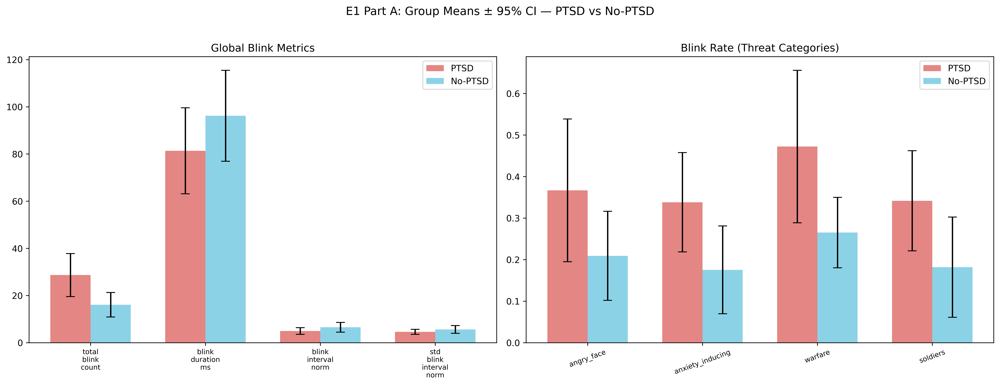

# Attentional Bias Toward Threat in PTSD: A Webcam-Based Eye-Tracking Study With Ukrainian Active-Duty Military Personnel

---

## 1. Data Preprocessing and Aggregation

Two preprocessing pipelines transformed raw gaze session files into analysis-ready datasets. The first pipeline (`compute_eyetracking_metrics.py`) processed 30 raw gaze session CSVs — each containing timestamped gaze samples with screen coordinates, blink flags, and scene indices — into a single-row-per-session summary of eye-tracking metrics across 11 image categories, yielding a dataset of 30 rows × 134 columns. The second pipeline (`compute_temporal_threat_bias.py`) preserved trial-level threat bias values for temporal trajectory analysis, producing three output files at session × slide, slide × group, and session grain levels.

### Metric Families

Session-level metrics were organised into seven families (Table S7 details the threat–neutral pairing scheme):

- **Dwell time** (22 columns): Mean and SD of dwell percentage per image category, computed from sample counts relative to expected slide duration.
- **Late-window dwell** (11 columns): Dwell percentage from 800 ms onward, isolating sustained attention after initial orienting.
- **Delta dwell** (4 columns): SD of threat-minus-neutral dwell across threat–neutral slides for each of four threat categories, capturing trial-to-trial attention bias variability.
- **Visit counts** (11 columns): Mean gaze visits (≥ 100 ms continuous runs) per category.
- **Late-window visits** (11 columns): Visit counts from 800 ms onward.
- **Off-screen gaze** (22 columns): Mean off-screen percentage per category, attributed to both images on a slide since gaze direction during off-screen periods is unknown.
- **Blink metrics** (27 columns): Blink rate, latency, duration, and inter-blink intervals with blink boundary splitting to prevent cross-slide contamination.

### Key Design Decisions

The late window was set at 800 ms to separate early orienting from sustained engagement, applied to dwell time, visit counts, and off-screen metrics. The visit threshold was set at 100 ms to filter saccadic transients. The mean was selected as the central tendency measure based on Shapiro-Wilk tests confirming normality for 93% of per-slide delta distributions.

### Threat–Neutral Pairing

Four threat categories were paired with eligible neutral counterparts: angry_face with neutral_face (10 slides), anxiety_inducing with neutral (14 slides), warfare with happy_event and neutral (12 slides), and soldiers with happy_face, neutral, and neutral_face (8 slides), yielding 44 threat–neutral slides out of 75 total (Table S7).

### Clinical Metadata

Both pipelines merged clinical metadata from the merged questionnaire dataset by matching on session identifier. Variables included binary PTSD status (`if_PTSD`), ITI PTSD symptom score (`ITI_PTSD`), ITI complex PTSD score (`ITI_cPTSD`), and binary antipsychotic medication status (`if_antipsychotic`).

---

## 2. Pre-Analysis Data Overview

### Sample Composition

The initial dataset comprised 30 sessions from Ukrainian active-duty military personnel. The PTSD group (*n* = 17) and No-PTSD group (*n* = 13) were defined by the International Trauma Interview (Roberts et al., 2025). Antipsychotic medication use was reported by 14 participants. Within the PTSD group, ITI PTSD scores ranged from 8 to 19 (*M* = 12.65, *Mdn* = 12.00, *SD* = 3.18). ITI complex PTSD scores ranged from 0 to 14 (*M* = 7.35, *Mdn* = 9.00), with 4 of 17 PTSD participants scoring 0 (Table 1; Figure 1).

*Figure 1.* Sample composition: PTSD status, antipsychotic medication use, and ITI score distributions.

### Distributional Characteristics

Metrics fell into three distributional regimes that informed test selection. Approximately normal distributions characterised mean dwell %, SD dwell %, SD delta dwell %, mean visits, blink latency, late-window dwell, and late-window visits. Severe right skew characterised total blink count, per-category blink rates, blink intervals, and off-screen percentages. Mean blink duration showed intermediate properties (Shapiro-Wilk *p* = .006, platykurtic). Normal-regime metrics were analysed with parametric tests; skewed metrics required non-parametric alternatives.

### Outlier Screening

Sessions were screened using the 1.5 × IQR rule across all numeric columns. Fifteen of 30 sessions had zero flags. One session (`UgMWkyrkRYVZ9cr9thRw`) accumulated 28 flags — 22 off-screen HIGH and 6 low dwell/visits — indicating near-zero engagement with stimulus content. Multivariate screening via Mahalanobis distances within seven metric subspaces (χ² threshold at *p* < .01) detected **no multivariate outliers**.

### Session Removal: Main Dataset (*N* = 29)

The flagged session showed 83–93% off-screen gaze across all 11 categories, with only 8% usable slides. The pattern was uniform across threat and neutral categories, indicating a technical recording anomaly (likely excessive distance from screen) rather than clinical avoidance. This session was excluded, yielding the 29-session main dataset used for H1–H6 and E2–E3 (PTSD *n* = 17, No-PTSD *n* = 12).

### Session Removal: Blink-Clean Dataset (*N* = 26)

Three additional sessions were removed for blink data quality: one with 217 total blinks (72.5/min, extreme high suggesting poor gaze quality inflating blink detection), and two with 7 and 4 total blinks (extreme low, likely tracker malfunction). The resulting 26-session blink-clean dataset (PTSD *n* = 15, No-PTSD *n* = 11) was used exclusively for E1.

### Blink Rate Concern

The sample's median blink rate was 5.7 blinks/min, substantially below the adult norm of 15–20 blinks/min. Forty percent of sessions (12 of 30) fell outside the 5–40 blinks/min plausibility range. This likely reflects under-detection by the webcam-based eye tracker or task-induced blink suppression and motivated the cautious treatment of blink-related findings as exploratory.

### Correlation Patterns

Per-category blink rates showed near-unity intercorrelations (*r* = 0.87–0.99), indicating blink rate is an individual-difference trait carrying minimal category-specific information. Off-screen percentages were similarly redundant (*r* = 0.87–0.99). By contrast, late-window dwell correlations were notably weaker than full-window (*r* = 0.13–0.91 vs. *r* = 0.38–0.93; 38 of 55 pairs significant at *p* < .05 vs. all 55), suggesting sustained attention after initial orienting carries more category-specific information.

---

## 3. Hypothesis Testing

### 3.1 Analytic Approach

Each hypothesis followed a standardised test selection procedure. For group comparisons, Shapiro-Wilk tests assessed normality in each group (α = .05), and Levene's test assessed variance equality (α = .05). If both groups passed normality and variances were equal, Student's *t*-test was used; if normality held but variances were unequal, Welch's *t*-test was used; if either group violated normality, the Mann-Whitney *U* test was used. For correlational analyses, both variables were tested for normality and OLS residuals were screened for outliers (|*z*| > 3); Pearson's *r* was used when assumptions were met, and Kendall's τ_b otherwise (preferred over Spearman for *n* < 20 due to better small-sample properties).

Effect sizes were computed as Cohen's *d* (with pooled *SD*) for *t*-tests, rank-biserial *r* for Mann-Whitney *U*, and Pearson's *r* or Kendall's τ_b for correlations. All effect sizes were reported with 95% confidence intervals. Benjamini-Hochberg FDR correction (Benjamini & Hochberg, 1995) was applied within pre-defined test families, with α = .05 (two-sided) throughout. Full assumption check details are in Table S6.

### Overview

Six pre-registered hypotheses tested whether PTSD status and symptom severity modulate attentional engagement with threat-related stimuli. **None reached statistical significance after Benjamini-Hochberg correction** (Table 2). However, two findings showed medium-to-large effect sizes that merit detailed examination.

### 3.2 H1: Mean Dwell Time on Threat Stimuli

*Prediction:* The PTSD group will show higher mean dwell time on threat stimuli than the No-PTSD group.

No meaningful group differences emerged for any of the four threat categories. Effect sizes were uniformly small: angry_face *t*(27) = 0.57, *p* = .576, *p*_BH = .786, *d* = 0.21, 95% CI [−0.58, 1.01]; anxiety_inducing *U* = 117.00, *p* = .521, *p*_BH = .786, *r* = −0.15, 95% CI [−0.49, 0.23]; warfare *t*(27) = 0.41, *p* = .686, *d* = 0.15; soldiers *t*(27) = −0.27, *p* = .786, *d* = −0.10. All 95% CIs crossed zero, indicating no meaningful group difference in gross attentional engagement with threat. The anxiety_inducing category required Mann-Whitney *U* due to non-normality in the PTSD group (Shapiro-Wilk *p* = .024). See Table 3 and Figure S2.

### 3.3 H2: Dwell Time Variability on Threat Stimuli

*Prediction:* The PTSD group will show higher within-participant variability (SD) of dwell time on threat stimuli.

All assumption checks passed (normality and equal variance), and Student's *t*-tests were used throughout. The angry_face category produced the strongest between-group effect in the entire study: *t*(27) = 2.00, *p* = .055, *p*_BH = .221, *d* = 0.76, 95% CI [−0.53, 2.04]. The PTSD group showed greater trial-to-trial variability in dwell time on angry faces (*M* = 16.79, *SD* = 5.00) compared to the No-PTSD group (*M* = 13.14, *SD* = 4.56). The anxiety_inducing category showed a similar but weaker pattern: *t*(27) = 1.65, *p* = .111, *p*_BH = .223, *d* = 0.62, 95% CI [−0.51, 1.76]. Warfare (*d* = 0.04) and soldiers (*d* = −0.01) showed negligible effects (Table 4).

*Figure 2a.* H2 effect sizes (all Cohen's *d*) with 95% CIs. Angry face (*d* = 0.76) and anxiety-inducing (*d* = 0.62) categories showed medium effects; warfare and soldiers were near zero.

*Figure 2b.* H2 group means with 95% CIs for dwell time variability across threat categories.

The elevated variability for angry faces in the PTSD group is consistent with an attentional dysregulation account: intermittent vigilance toward and avoidance of socially threatening stimuli, producing fluctuating engagement across trials rather than a stable bias in one direction. The distributional detail is shown in Figure S1.

### 3.4 H3: Delta Dwell Variability

*Prediction:* The PTSD group will show higher variability of the attention bias score (threat minus neutral dwell).

All assumption checks passed. No category reached significance: anxiety_inducing *t*(27) = 0.96, *p* = .347, *p*_BH = .960, *d* = 0.36, 95% CI [−0.53, 1.25]; angry_face *d* = 0.22; warfare *d* = 0.05; soldiers *d* = −0.02 (Table 4; Figure S3).

The key contrast between H2 and H3 is informative: H2's raw dwell SD for angry faces (*d* = 0.76) was substantially larger than H3's delta-based measure for the same category (*d* = 0.22). This suggests that the H2 signal reflects global arousal-driven variability in attention to threat rather than selective fluctuation in the *relative* bias toward threat versus neutral stimuli. The delta computation may cancel out individual differences in overall dwell time that contribute to the group difference.

### 3.5 H4: ABV–Severity Correlation

*Prediction:* Attention bias variability will correlate positively with ITI PTSD severity within the PTSD group (*n* = 17).

All variables passed normality checks and no outliers were detected, so Pearson's *r* was used throughout. No correlation reached significance in either test family. Importantly, the direction of most associations was **negative** — opposite to the hypothesised positive relationship. In Family 1 (raw dwell SD), the strongest associations were soldiers *r* = −0.42, *p* = .090, *p*_BH = .201, 95% CI [−0.75, 0.07] and anxiety_inducing *r* = −0.40, *p* = .116, *p*_BH = .201, 95% CI [−0.74, 0.11]. In Family 2 (delta dwell SD), warfare showed the strongest association: *r* = −0.36, *p* = .157, *p*_BH = .338, 95% CI [−0.72, 0.15]. The only positive coefficient was angry_face in Family 1 (*r* = 0.14, *p* = .606), a negligible effect (Table S1; Figure S4; Figure S11).

While initially unexpected, this negative pattern converges with H6's avoidance findings: as symptom severity increases, attentional engagement with threat becomes more rigidly avoidant rather than oscillatory, reducing trial-to-trial variability. ITI PTSD scores ranged from 8 to 19 (*SD* = 3.18), and this restricted range likely attenuated correlations. A correlation of |*r*| ≥ 0.48 would be needed for 80% power at α = .05 (two-tailed) with *n* = 17.

### 3.6 H5: Visit Counts to Threat Stimuli

*Prediction:* The PTSD group will show more revisits to threat stimuli, with larger differences in the late viewing window.

No group differences emerged in either the overall or late viewing window. Effect sizes were uniformly small across all eight comparisons (|*d*| ≤ 0.31, |*r*| ≤ 0.18; Table 3; Figure S5). The largest overall effect was angry_face overall visits *t*(27) = 0.81, *p* = .425, *p*_BH = .571, *d* = 0.31, 95% CI [−0.55, 1.16]. The secondary prediction that late-window differences would exceed overall differences was not confirmed — late-window effect sizes were comparable to or smaller than overall effect sizes (e.g., angry_face late *d* = 0.19 vs. overall *d* = 0.31). The soldiers category required Mann-Whitney *U* in the overall family due to non-normality in the No-PTSD group (Shapiro-Wilk *p* = .013).

### 3.7 H6: Avoidance-Like Gaze and Symptom Severity

*Prediction:* Within the PTSD group, higher ITI severity is associated with avoidance of threat — lower dwell time, fewer visits, and higher off-screen looking.

This hypothesis was tested with a dual approach: Part A used a median split on ITI PTSD scores (Lower-ITI *n* = 8, ITI < 12; Higher-ITI *n* = 9, ITI ≥ 12), and Part B treated ITI as a continuous predictor.

#### Part A: Median-Split Group Comparison

The angry face category produced the study's largest overall effect. Across all six DV families, the Higher-ITI subgroup showed a coherent pattern of reduced engagement with angry faces (Table 5; Figure 3a, 3b):

- **F1 (Total dwell %):** *t*(15) = −2.68, *p* = .017, *p*_BH = .068, *d* = −1.30, 95% CI [−3.35, 0.74]
- **F3 (Late dwell %):** *t*(15) = −2.24, *p* = .041, *p*_BH = .163, *d* = −1.09, 95% CI [−2.87, 0.70]
- **F2 (Visit count):** *t*(15) = −2.11, *p* = .052, *p*_BH = .208, *d* = −1.03, 95% CI [−2.74, 0.69]
- **F4 (Late visits):** *t*(15) = −1.69, *p* = .112, *d* = −0.82
- **F5 (Off-screen %):** *t*(15) = 1.41, *p* = .179, *d* = 0.68
- **F6 (Late off-screen %):** *t*(15) = 1.08, *p* = .295, *d* = 0.53

Five of six DV families were directionally consistent with avoidance: the Higher-ITI subgroup spent less time on angry faces, made fewer visits, and showed more off-screen looking. The multi-metric convergence strengthens the avoidance interpretation beyond any single test.

The avoidance pattern extended partially to other threat categories: soldiers off-screen *d* = 0.80, *p* = .120; anxiety_inducing total dwell *d* = −0.73, *p* = .154. Full results for all categories across all families are in Table S3. Distributional detail is in Figure S6.

*Figure 3a.* H6-A effect sizes with 95% CIs for angry face across all 6 DV families. Most are Cohen's *d*; entries marked (*r*) use rank-biserial correlation where Mann-Whitney *U* was applied due to non-normality. Negative *d* values indicate the Higher-ITI subgroup showed less engagement; note that *r* and *d* have different scales and sign conventions.

*Figure 3b.* H6-A group means with 95% CIs for Higher-ITI vs. Lower-ITI subgroups across DV families and threat categories.

#### Part B: Continuous Correlational Analysis

No significant correlations emerged between ITI scores and any gaze metric when treated as a continuous variable (all *p*_BH > .34; Table S2; Figure S7; Figures S12–S13). Correlations with dwell and visit metrics were uniformly negative (*r* = −0.02 to −0.32), and correlations with off-screen metrics were mostly positive (*r* = −0.01 to 0.23) — consistent with the avoidance hypothesis direction. The strongest trends were anxiety_inducing late dwell τ_b = −0.32, *p* = .087, *p*_BH = .346 and anxiety_inducing total dwell τ_b = −0.30, *p* = .103, *p*_BH = .412. Four DVs used Kendall's τ_b due to non-normality; the remaining 20 used Pearson's *r*.

The greater sensitivity of the median-split approach compared to continuous correlation suggests a threshold-like rather than linear relationship between symptom severity and avoidance behavior.

### 3.8 Summary of Hypothesis Testing

None of the six pre-registered hypotheses reached statistical significance after BH-FDR correction. Table 3 combines the uniformly null results for H1 (mean dwell time) and H5 (visit counts), where all effect sizes were small (|*d*| ≤ 0.31). Table 4 contrasts H2 and H3, highlighting that raw dwell variability (H2 angry face *d* = 0.76) captured group differences that the delta-based measure (H3 angry face *d* = 0.22) did not. The two strongest signals — H6-A angry face avoidance (*d* = −1.30) and H2 angry face dwell variability (*d* = 0.76) — are discussed further in the General Discussion.

---

## 4. Exploratory Analyses

Three exploratory analyses extended beyond the pre-registered hypotheses. All produced null results after BH-FDR correction (Table 6).

### 4.1 E3: Temporal Dynamics of Threat Bias

*Sample:* Main dataset, *N* = 29 (PTSD *n* = 17, No-PTSD *n* = 12).

Group-level temporal trajectories across 44 threat trials largely overlapped, with both groups showing generally positive threat bias (dwell on threat > neutral; Figure 4). PTSD group mean range: [−9.82, 23.64]; No-PTSD group mean range: [−11.99, 19.52].

*Figure 4.* Temporal trajectory of threat attentional bias across 44 threat–neutral trials. Lines show group means; shaded bands show 95% CIs. Both groups oscillate above zero (positive threat bias).

All five TL-BS variability indices were non-significant after correction. The largest effect was peak_toward: *t*(27) = 1.03, *p* = .315, *p*_BH = .862, *d* = 0.39, 95% CI [−0.53, 1.30]. Session SD (*d* = 0.14), TL-BS mean (*r* = −0.08), peak away (*d* = 0.07), and range (*d* = 0.23) were all small. Individual spaghetti plots (Figure S10) showed massive within-session variability in both groups.

Two design features likely drove these null results. First, the 44 threat–neutral slides were interspersed among 75 total slides, with 31 non-threat slides omitted from analysis. Treating these as contiguous (trial index 1–44) breaks the temporal continuity assumption from Zvielli et al. (2015) and Schäfer et al. (2016), where consecutive trials were all bias-relevant. The intervening non-threat content likely reset accumulating attentional patterns. Second, the No-PTSD group consisted of trauma-exposed soldiers who may exhibit similar threat-related attentional dynamics as the PTSD group, unlike the civilian controls used in prior TL-BS research. Fixed trial order further confounds temporal position with stimulus category.

### 4.2 E1: Blink Metrics

*Sample:* Blink-clean dataset, *N* = 26 (PTSD *n* = 15, No-PTSD *n* = 11).

Total blink count showed the largest group effect: *t*(24) = 2.13, *p* = .044, *p*_BH = .088, *d* = 0.84, 95% CI [−0.56, 2.25]. The PTSD group blinked more (*M* = 28.7, *SD* = 18.04) than the No-PTSD group (*M* = 16.1, *SD* = 8.80). Per-category blink rates for threat stimuli showed consistent small-to-medium effects (*r* = −0.25 to −0.45), with higher rates in the PTSD group across all four threat categories, though none survived correction (all *p*_BH = .128; Table S4; Figure S8).

Within the PTSD group (*n* = 15), mean blink duration trended negatively with ITI severity: Kendall's τ_b = −0.37, *p* = .062, *p*_BH = .062, 95% CI [−0.71, 0.00], suggesting that more severe PTSD may be associated with shorter blinks. All Part B correlations used Kendall's τ_b because ITI_PTSD was non-normal in this subsample (Shapiro-Wilk *p* = .009).

*Figure 5.* E1 group means with 95% CIs for blink metrics.

The sample median blink rate of 6.0/min (well below the adult norm of 15–20/min) suggests substantial under-detection by the webcam-based eye tracker or task-induced blink suppression. The high intercorrelation of per-category blink rates (*r* = 0.43–0.97, median ∼0.85) indicates that blink rate is an individual-difference trait and that the consistent direction across threat categories likely reflects overall blink propensity rather than category-specific responses.

### 4.3 E2: Medication–Attention Moderation

*Sample:* Main dataset, *N* = 29; 2 × 2 design (PTSD × Antipsychotic) with cell sizes *n* = 6–9.

The antipsychotic group showed numerically higher mean dwell time across all threat categories, with medium effect sizes: soldiers *d* = 0.71, *p* = .068, *p*_BH = .173; warfare *d* = 0.60, *p* = .120, *p*_BH = .173; angry_face *d* = 0.52, *p* = .173; anxiety_inducing *r* = −0.30, *p* = .169, *p*_BH = .173. No differences emerged for dwell variability (*d* < 0.40) or visit counts (*d* = 0.23–0.49), consistent with a general processing slowdown rather than a change in attentional strategy (Figure S9).

A 2 × 2 permutation ANOVA (10,000 permutations) found no significant main effects or interactions (Table S5). The strongest effect was a PTSD main effect on SD dwell % angry_face (*F* = 3.71, *p*_perm = .063, *p*_BH = .211). The interaction term was non-significant for all 12 DVs, though descriptive patterns suggested a numerically larger antipsychotic-related dwell increase within the PTSD subgroup (e.g., warfare: 13.3 pp difference in PTSD vs. 2.2 pp in No-PTSD).

*Figure 6.* E2 interaction plots showing cell means ± SE for the PTSD × Antipsychotic factorial design across all DVs.

The consistent pattern of longer dwell times in the antipsychotic group is plausibly explained by the pharmacological profile of second-generation antipsychotics. Dopamine D2 receptor antagonism, combined with anticholinergic and antihistaminergic properties, slows cognitive processing and would prolong fixations — manifesting as higher dwell percentages without changes in variability or visit strategy. Cell sizes of *n* = 6–9 provide negligible power for a factorial design; approximately 60–100 participants per cell would be needed to detect medium effects.

---

## 5. General Discussion

None of the six pre-registered hypotheses reached statistical significance after Benjamini-Hochberg correction. The study was underpowered for the observed effect sizes, which ranged from negligible to large. This section focuses on the patterns that emerged across analyses rather than any individual test.

### Cross-Cutting Patterns

**Angry faces are the most sensitive stimulus.** Across all hypotheses, the angry_face category consistently produced the largest effects: H2 *d* = 0.76 (dwell variability), H6-A *d* = −1.30 (avoidance). This is theoretically coherent — angry faces convey direct social threat and are processed rapidly via dedicated neural circuits (e.g., amygdala fast pathway), making them the most likely stimulus to trigger threat-related attentional biases. Other threat categories (warfare, soldiers, anxiety-inducing scenes) produced weaker effects, possibly because scene stimuli require more complex visual processing and carry less immediate threat proximity than a direct facial expression of anger.

**Within-PTSD severity analyses outperform between-group comparisons.** H6 median-split effects (|*d*| = 0.68–1.30) were substantially larger than any PTSD-vs-No-PTSD comparison (largest |*d*| = 0.76 in H2). This suggests that attentional biases are modulated by symptom severity rather than being a uniform feature of the PTSD diagnosis, and that the No-PTSD control group — consisting of trauma-exposed military personnel — may include subclinical individuals who dilute between-group contrasts.

**Dwell variability is the strongest between-group metric.** H2's raw dwell SD (*d* = 0.76 for angry faces) outperformed every other between-group measure: mean dwell time (H1 |*d*| ≤ 0.21), delta-based variability (H3 |*d*| ≤ 0.36), and visit counts (H5 |*d*| ≤ 0.31). Attentional *instability* rather than a stable directional bias may be the most accessible behavioural signature of PTSD in this paradigm, consistent with the attention bias variability framework (Zvielli et al., 2015).

**Coherent multi-metric avoidance pattern.** In H6-A, five of six DV families showed directionally consistent effects for angry faces in the Higher-ITI subgroup: lower total dwell (*d* = −1.30), fewer visits (*d* = −1.03), lower late dwell (*d* = −1.09), fewer late visits (*d* = −0.82), and more off-screen looking (*d* = 0.68). Only late off-screen (*d* = 0.53) was weaker. This multi-metric convergence strengthens the avoidance interpretation beyond any single test and is consistent with the vigilance-avoidance model (Cisler & Koster, 2010).

### Toward a Severity-Dependent Model

The combination of H2, H4, and H6 findings suggests a severity-dependent progression in attentional processing of threat:

1. **H2** (between-group): The PTSD group as a whole shows elevated dwell variability relative to controls (*d* = 0.76), consistent with oscillatory vigilance-avoidance dynamics.
2. **H4** (within-PTSD): Higher symptom severity trends toward *less* variable dwell time (strongest *r* = −0.42), suggesting a shift from oscillation to rigid engagement patterns.
3. **H6** (within-PTSD): Higher symptom severity is associated with pronounced avoidance of angry faces (*d* = −1.30), indicating that the rigid pattern is one of sustained avoidance.

This suggests that moderate PTSD may be characterised by oscillatory attentional dysregulation — fluctuating vigilance and avoidance — while more severe PTSD resolves into sustained avoidance. This interpretation reframes attentional bias variability and avoidance not as competing accounts but as points along a severity continuum. Future work should model this as a non-linear trajectory rather than treating ABV and avoidance as alternative explanations.

### Methodological Considerations

**Webcam-based eye-tracking feasibility.** The study demonstrates that webcam-based eye tracking can detect medium-to-large effect sizes in clinical populations, though several limitations constrain precision. The substantial blink under-detection (median 6/min vs. norm 15–20/min) limits confidence in blink-based metrics. Off-screen gaze was redundant across categories (*r* = 0.87–0.99), suggesting it reflects overall data quality or disengagement rather than stimulus-specific avoidance.

**Fixed trial order.** All participants viewed slides in the same order, confounding stimulus category with presentation position. This prevents clean separation of temporal habituation effects from category effects and may have contributed to the null results in E3.

### Limitations

The primary limitation is **small sample size**. With *n* = 17 (PTSD) and *n* = 12 (No-PTSD), the study was underpowered for the observed effects. For the H6-A angry face dwell effect (*d* = 1.30), 80% power requires approximately *n* = 10 per subgroup; for H2's dwell variability (*d* = 0.76), approximately *n* = 29 per group; for the E2 medication moderation, approximately *n* = 60–100 per cell.

Additional limitations include: (a) no civilian control group, limiting interpretation of the No-PTSD comparison group as trauma-exposed individuals may show subclinical threat-processing differences; (b) cross-sectional design preventing causal inference about the relationship between symptom severity and attentional avoidance; (c) restricted ITI PTSD score range (8–19, *SD* = 3.18), which attenuates severity-dependent correlations (H4, H6-B); (d) Benjamini-Hochberg correction, while appropriate, is inherently costly at small *N* where medium effects produce *p*-values near .05 that are pushed further from significance by correction.

---

## 6. Future Research Directions

The present findings suggest several priorities for future studies:

**Power requirements.** Based on observed effect sizes: *d* = 1.30 (H6-A avoidance) requires ∼10 per subgroup for 80% power; *d* = 0.76 (H2 dwell variability) requires ∼29 per group; medication moderation effects (*d* ≈ 0.60) require ∼60–100 per cell for factorial designs.

**Stimulus selection.** The dominance of angry faces across all hypotheses suggests that future studies should prioritise stimuli with high threat proximity and immediate recognisability. Direct social threat (angry faces) and proximal combat-related stimuli (e.g., FPV drone footage, close combat imagery) may produce stronger effects than generic scene-level stimuli.

**Design improvements.** Contiguous threat trial blocks would enable valid temporal trajectory analysis (Zvielli et al., 2015). Civilian control groups would provide a cleaner baseline than trauma-exposed military personnel. Randomised slide order would eliminate order confounds. Blink detection should be validated against laboratory-grade equipment. Medication status should be used as a stratification variable from the outset.

**Analytic approaches.** The threshold-like severity–avoidance relationship observed in H6 suggests that non-linear dose-response models may outperform linear correlation. Bayesian approaches could provide more informative inference at small sample sizes by quantifying evidence for and against effects rather than relying on *p*-values alone. The severity-dependent progression model (oscillation → avoidance) should be tested explicitly with adequate within-PTSD sample sizes and broader symptom severity ranges.

---

## 7. Technical Stack

All analyses were conducted in Python 3.10.13 within a Conda environment. Table 7 lists the complete software stack. Claude Opus 4.6 (Anthropic) assisted with analysis pipeline development, statistical interpretation, and manuscript preparation; all outputs were verified against source data by the authors.

---

## 8. References

Benjamini, Y., & Hochberg, Y. (1995). Controlling the false discovery rate: A practical and powerful approach to multiple testing. *Journal of the Royal Statistical Society: Series B (Methodological)*, *57*(1), 289–300. https://doi.org/10.1111/j.2517-6161.1995.tb02031.x

Cisler, J. M., & Koster, E. H. W. (2010). Mechanisms of attentional biases towards threat in anxiety disorders: An integrative review. *Clinical Psychology Review*, *30*(2), 203–216. https://doi.org/10.1016/j.cpr.2009.11.003

Roberts, N. P., Hyland, P., Fox, R., Roberts, A., Lewis, C., Cloitre, M., Brewin, C. R., Karatzias, T., Shevlin, M., Gelezelyte, O., Bondjers, K., Fresno, A., Souch, A., & Bisson, J. I. (2025). The International Trauma Interview (ITI): Development of a semi-structured diagnostic interview and evaluation in a UK sample. *European Journal of Psychotraumatology*, *16*(1), 2494361. https://doi.org/10.1080/20008066.2025.2494361

Schäfer, J., Bernstein, A., Zvielli, A., Höfler, M., Wittchen, H.-U., & Schönfeld, S. (2016). Attentional bias temporal dynamics predict posttraumatic stress symptoms: A prospective-longitudinal study among soldiers. *Depression and Anxiety*, *33*(7), 630–639. https://doi.org/10.1002/da.22526

Zvielli, A., Bernstein, A., & Koster, E. H. W. (2015). Temporal dynamics of attentional bias. *Clinical Psychological Science*, *3*(5), 772–788. https://doi.org/10.1177/2167702614551572

---

## Supplementary Materials

The following supplementary figures and tables are referenced in the main text:

### Supplementary Figures

- **Figure S1.** H2 violin plots showing distributional detail for dwell time variability by group (`figure_s1_violin_h2_dwell_variability.png`).
- **Figure S2.** H1 forest plot of effect sizes for mean dwell time; Cohen's *d* for all categories except anxiety_inducing (rank-biserial *r*, Mann-Whitney *U*) (`figure_s2_forest_h1_dwell_time.png`).
- **Figure S3.** H3 forest plot of effect sizes for delta dwell variability (all Cohen's *d*) (`figure_s3_forest_h3_delta_variability.png`).
- **Figure S4.** H4 forest plot of correlation coefficients (Family 1: raw dwell SD; all Pearson's *r*) (`figure_s4_forest_h4_correlation_family1.png`).
- **Figure S5.** H5 forest plot of effect sizes for visit counts; Cohen's *d* for all categories except soldiers overall (rank-biserial *r*, Mann-Whitney *U*) (`figure_s5_forest_h5_visits.png`).
- **Figure S6.** H6-A violin plots showing distributional detail for all 6 DV families (`figure_s6_violin_h6a_all_families.png`).
- **Figure S7.** H6-B forest plot of correlation coefficients; mix of Pearson's *r* and Kendall's τ_b (see Table S2 for test used per metric) (`figure_s7_forest_h6b_correlation.png`).
- **Figure S8.** E1 forest plot of effect sizes for blink metrics; Cohen's *d* for global metrics (F1–F3), rank-biserial *r* for blink rates (F4, Mann-Whitney *U*) (`figure_s8_forest_e1_blink.png`).
- **Figure S9.** E2 forest plot of effect sizes for medication group comparisons; Cohen's *d* for all categories except anxiety_inducing dwell (rank-biserial *r*, Mann-Whitney *U*) (`figure_s9_forest_e2_medication.png`).
- **Figure S10.** E3 spaghetti plots showing individual trial-level trajectories (`figure_s10_spaghetti_e3_trajectories.png`).
- **Figure S11.** H4 scatter plots: ITI PTSD severity × raw dwell variability (Family 1) for all 4 threat categories (`figure_s11_scatter_h4_family1.png`).
- **Figure S12.** H6 scatter plots: ITI PTSD severity × total dwell % (F1) for all 4 threat categories (`figure_s12_scatter_h6a_f1_dwell.png`).
- **Figure S13.** H6 scatter plots: ITI PTSD severity × late-window dwell % (F3) for all 4 threat categories (`figure_s13_scatter_h6a_f3_late_dwell.png`).

### Supplementary Tables

- **Table S1.** H4 full correlation results (both families).
- **Table S2.** H6-B full correlational results (all 6 DV families × 4 categories).
- **Table S3.** H6-A full median-split results (all 6 DV families × 4 categories).
- **Table S4.** E1 full blink metric results (Parts A and B).
- **Table S5.** E2 permutation ANOVA results (all 3 effects × 3 families × 4 categories).
- **Table S6.** Assumption checks summary across hypotheses.
- **Table S7.** Threat–neutral pairing scheme.
