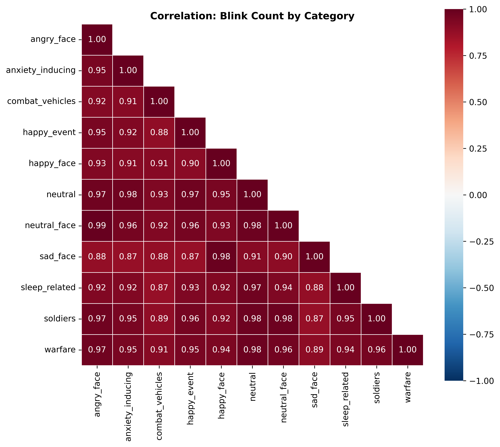

# Eye-Tracking Metrics Overview Report

## 1. Dataset Overview

The eye-tracking metrics dataset contains **30 sessions x 90 columns**. Column types: 76 float64, 13 int64, and 1 object (session_id).

### Column Groups

| Metric Family | Columns | Description |
|---|---|---|
| mean_dwell_pct | 11 | Mean dwell percentage on AOI per image category |
| std_dwell_pct | 11 | Within-session variability of dwell percentage |
| std_delta_dwell_pct | 4 | Variability of threat-minus-neutral dwell bias (threat categories only) |
| mean_visits | 11 | Mean number of AOI visits per image category |
| blink_count | 11 | Total blink count per image category |
| mean_blink_duration | 11 | Mean blink duration per category (ms) |
| std_blink_duration | 11 | Within-session variability of blink duration |
| mean_blink_latency | 11 | Mean latency to first blink per category (ms) |
| global_blink | 4 | Session-level blink metrics (total count, mean duration, mean/std interval) |

### Missingness

Blink duration and blink latency columns have substantial missingness because some sessions produce zero blinks in certain categories, making duration and latency undefined. NaN counts range from 1 (happy_face) to 14 (combat_vehicles, sleep_related). These are structurally missing values, not data collection failures. All other metric families (dwell, visits, blink counts, global blink) are complete.

### Metadata Variables

The dataset includes four metadata columns alongside session_id:

**Group counts:**
- **if_PTSD**: n = 17 PTSD, n = 13 non-PTSD
- **if_antipsychotic**: n = 14 antipsychotic-use, n = 16 non-use

**ITI scores (PTSD group only, n = 17):**

| Metric | Mean | Median | SD | Min | Max | Zero count |
|---|---|---|---|---|---|---|
| ITI_PTSD | 12.65 | 12.00 | 3.18 | 8.0 | 19.0 | 0 |
| ITI_cPTSD | 7.35 | 9.00 | 4.60 | 0.0 | 14.0 | 4 |

ITI descriptives are computed only for PTSD participants (if_PTSD == 1), since non-PTSD participants have 0 by definition. All PTSD participants have non-zero ITI_PTSD scores (range 8-19). ITI_cPTSD shows more spread, with 4 of 17 PTSD participants scoring 0 on the complex PTSD subscale.

## 2. Descriptive Statistics

### Mean Dwell Percentage

Dwell percentages are roughly symmetric across all 11 categories, with means ranging from 19.7% (neutral) to 28.7% (anxiety_inducing). Standard deviations range from 7.8% to 15.2%, indicating moderate between-subject variability. The neutral category has the narrowest spread, while anxiety_inducing and warfare are the most variable.

Shapiro-Wilk tests show no category significantly deviates from normality at p < 0.05 (lowest p = 0.059 for anxiety_inducing). This is the most well-behaved metric family.

### Std Dwell Percentage

Within-session dwell variability (std) averages 15-20% across categories. Two categories show marginal normality violations: std_dwell_pct_anxiety_inducing (Shapiro p = 0.031) and std_dwell_pct_neutral (Shapiro p = 0.016), both driven by mild skewness.

### Std Delta Dwell (Threat Bias Variability)

The four threat-bias variability metrics (angry_face, anxiety_inducing, warfare, soldiers) have means near 25-26% and show approximately symmetric distributions. All pass the Shapiro-Wilk normality test (p > 0.40).

### Mean Visits

Mean visits per category range from 1.19 (combat_vehicles) to 1.75 (anxiety_inducing), with standard deviations of 0.49-0.84. Distributions are roughly symmetric with mild negative skewness in some categories. All pass the Shapiro-Wilk test (lowest p = 0.185 for soldiers).

### Global Blink Metrics

Global blink metrics are severely non-normal:

| Metric | Mean | Median | Skewness | Kurtosis | Shapiro p |
|---|---|---|---|---|---|
| total_blink_count | 28.2 | 17.0 | 4.02 | 16.87 | < 0.0001 |
| mean_blink_duration_ms | 87.8 | 78.9 | -0.08 | -1.10 | 0.006 |
| mean_blink_interval_ms | 16,327 | 11,551 | 2.41 | 6.97 | < 0.0001 |
| std_blink_interval_ms | 14,625 | 11,221 | 2.48 | 6.88 | < 0.0001 |

Total blink count and blink interval metrics are strongly right-skewed with heavy tails, driven by one extreme session (DTGxc0RwsWrTMRKpenb8, 217 blinks). Mean blink duration is platykurtic but not severely skewed.

### Blink Count by Category

Per-category blink counts are heavily right-skewed across all 11 categories (skewness 2.9-4.2, kurtosis 10.8-17.9). All fail the Shapiro-Wilk test (p < 0.0001). The neutral category has the highest mean (18.0 blinks), consistent with it having the most slides (10 neutral slides vs. fewer per emotional category).

### Mean Blink Latency

Blink latency is the most affected by missingness (n = 21-29 per category vs. 30 for complete metrics). Mean latencies cluster around 1,050-1,290 ms, with combat_vehicles notably lower at 770 ms (shorter slides may explain this). Distributions are approximately normal; all pass the Shapiro-Wilk test (p > 0.12).

## 3. Distributional Observations

The metrics fall into two distributional regimes:

1. **Approximately normal**: Mean dwell %, std dwell %, std delta dwell %, mean visits, and mean blink latency. These are suitable for parametric tests (t-tests, ANOVA) with n = 30.

2. **Severely right-skewed**: Total blink count, per-category blink counts, mean blink interval, and std blink interval. These require non-parametric tests (Mann-Whitney U, Kruskal-Wallis) or log-transformation before parametric analysis.

Mean blink duration occupies an intermediate position: it fails the Shapiro-Wilk test (p = 0.006) primarily due to platykurtosis rather than skewness.

## 4. Outlier Detection

### Univariate IQR Outliers

Sessions were flagged across all numeric columns using the 1.5x IQR rule. 15 of 30 sessions had zero flags. Detailed breakdown of the top flagged sessions:

**DTGxc0RwsWrTMRKpenb8 (12 flags) [POOR QUALITY]**: All 12 flags are blink counts (HIGH) — every per-category blink count plus total_blink_count is extreme (e.g., total = 217, neutral = 145, warfare = 41). This session's poor gaze quality likely inflates blink detection.

**9Pd2lTJaNZ7CGrLBPjuU (8 flags)**: 7 blink count flags (HIGH: total = 73, neutral = 44, angry_face = 13, anxiety_inducing = 12, warfare = 18, combat_vehicles = 7, soldiers = 7) plus 1 visit count flag (mean_visits_happy_event = 3.0, HIGH). This is a high-blink-rate participant but not a poor-quality session.

**UgMWkyrkRYVZ9cr9thRw (4 flags) [POOR QUALITY]**: 1 dwell flag (mean_dwell_pct_neutral = 0.86%, LOW) and 3 visit flags (happy_event = 0.0, neutral = 0.1, neutral_face = 0.08, all LOW). Consistent with near-zero gaze engagement from only 8% usable slides.

**RBRGZzWIzDitollqkpzW and xn3yMJ8STzchnQPg94lH (2 flags each)**: Both flagged on blink interval metrics (mean_blink_interval_ms and std_blink_interval_ms, HIGH), reflecting very low blink rates (7 and 4 total blinks respectively).

### Outlier Box Plots

Box plots with IQR whiskers and individual session points (red = poor gaze quality) for each metric group that produced outlier flags.

**Blink counts** — DTGxc0RwsWrTMRKpenb8 is a clear extreme outlier across all categories; 9Pd2lTJaNZ7CGrLBPjuU is a secondary high-blink session.

**Mean visits** — A few sessions fall outside the whiskers (UgMWkyrkRYVZ9cr9thRw at the low end, 9Pd2lTJaNZ7CGrLBPjuU at the high end).

**Mean dwell %** — UgMWkyrkRYVZ9cr9thRw is visible as a low outlier on several categories.

**Blink interval** — Two sessions with very few blinks produce extreme high interval values.

**Blink latency** — Mild outliers only; distributions are relatively well-behaved.

### Multivariate Mahalanobis Distance

Mahalanobis distances were computed within three metric subspaces using a chi-squared threshold at p < 0.01:

**Mean Dwell %**: No sessions exceeded the critical value (chi2 = 4.97). The distribution of Mahalanobis distances is compact (range 1.70-4.57), suggesting no multivariate dwell outliers.

**Mean Visits**: No multivariate outliers detected (range 1.73-4.43, critical = 4.97).

**Blink Metrics** (counts + interval + duration): One session exceeded the threshold — **DTGxc0RwsWrTMRKpenb8** (d = 5.86 vs. critical = 5.40). This is a poor-quality session already flagged in the gaze quality check.

### Cross-Reference with Poor Gaze Quality Sessions

The three sessions previously flagged for poor gaze quality (see [Gaze Quality Check Report](gaze_quality_check_report.md)):

| Session | IQR Flags (Rank) | Mahalanobis Outlier? |
|---|---|---|
| DTGxc0RwsWrTMRKpenb8 | 12 (1st/30) | Yes (blink metrics) |
| UgMWkyrkRYVZ9cr9thRw | 4 (3rd/30) | No |
| xx19J8Xeoc4thStIAtUe | 1 (11th/30) | No |

DTGxc0RwsWrTMRKpenb8 is a clear outlier across both univariate and multivariate methods. UgMWkyrkRYVZ9cr9thRw is moderately anomalous. xx19J8Xeoc4thStIAtUe falls within normal ranges on most metrics, consistent with its borderline gaze quality (45.3% usable slides, just below the 50% threshold but not dramatically so).

## 5. Correlation Structure

With n = 30, the critical values for Pearson r are |r| >= 0.36 (p < 0.05) and |r| >= 0.46 (p < 0.01).

### Mean Dwell %

All pairwise correlations are positive (range 0.38-0.93) and significant at p < 0.05. 51 of 55 pairs reach p < 0.01; the four that reach only p < 0.05 are angry_face–happy_face (r = 0.45), angry_face–neutral_face (r = 0.38), anxiety_inducing–happy_event (r = 0.43), and happy_event–warfare (r = 0.45). This indicates a strong individual-differences component: participants who dwell more on one category tend to dwell more on all categories.

Notable clusters:
- **Military-threat cluster**: soldiers-warfare (r = 0.93), soldiers-sleep_related (r = 0.84), sad_face-combat_vehicles (r = 0.89), angry_face-sad_face (r = 0.86)
- **Positive/neutral cluster**: happy_event-happy_face (r = 0.80), happy_event-neutral (r = 0.84), happy_face-neutral_face (r = 0.88)

The cluster structure suggests that threat-related and positive/neutral categories share within-cluster variance, but there is substantial cross-cluster correlation as well.

### Mean Visits

Correlations are uniformly positive (range 0.38-0.87) and all significant at p < 0.05. 51 of 55 pairs reach p < 0.01; the four that reach only p < 0.05 involve warfare (happy_event–warfare r = 0.38, neutral_face–warfare r = 0.41, happy_face–warfare r = 0.41) and one face pair (happy_face–neutral_face r = 0.39). The highest correlations appear within the military-threat cluster (soldiers-warfare r = 0.87) and the positive cluster (happy_face-neutral r = 0.87).

### Blink Count

Per-category blink counts show very high intercorrelations (range 0.87-0.99), all significant at p < 0.01, indicating that blink counts are dominated by an individual blink-rate trait rather than category-specific effects. This is expected: blink rate is largely physiological and should not vary substantially by stimulus content over short viewing windows. The near-unity correlations confirm that category-level blink counts are primarily driven by overall blink frequency.

### Dwell % vs. Visits Scatter

Dwell percentage and visit count are positively associated within categories. The poor-quality sessions (red points in the scatter plots) tend to cluster at the low end of both metrics, consistent with reduced gaze engagement.

## 6. Domain Sanity Checks

### Blink Rate

Estimated session duration: 179.5 seconds (3.0 minutes). Typical adult blink rate is 15-20 blinks/min.

- **Sample**: Mean 9.4 blinks/min, median 5.7 blinks/min, range 1.3-72.5.
- **12 of 30 sessions** (40%) fall outside the 5-40 blinks/min plausibility range.
- The low median (5.7) and the large number of sub-5 sessions suggest the eye tracker's blink detection may under-count blinks, or that the task (sustained visual attention to slides) suppresses blink rate.
- One extreme outlier: DTGxc0RwsWrTMRKpenb8 at 72.5 blinks/min (217 total). This is a poor-quality session where noise in the gaze signal likely inflates the blink count.

### Dwell Percentage Range

Only one session produces implausibly low dwell values (< 1%): **UgMWkyrkRYVZ9cr9thRw**, with 0.0% dwell on combat_vehicles, happy_event, and soldiers, and near-zero on neutral (0.86%), sleep_related (0.19%), and warfare (0.45%). This is a known poor-quality session with only 8% usable slides. No sessions show implausibly high values (> 90%).

### Delta Dwell Uniformity

Three std_delta_dwell_pct values are suspiciously close to zero (< 5), all from session **UgMWkyrkRYVZ9cr9thRw**: angry_face (1.38), warfare (2.28), soldiers (0.95). Near-zero variability in the threat-bias metric implies the participant showed no slide-to-slide fluctuation in attentional bias, which is consistent with near-zero gaze engagement overall rather than a meaningful pattern.

## 7. PTSD-Group Visual Preview

### Mean Dwell %

Violin plots split by PTSD status show largely overlapping distributions across all categories. No category shows a dramatic separation between groups. The PTSD group may show slightly wider spread in some threat categories (combat_vehicles, soldiers, warfare), but with only 17 PTSD and 13 non-PTSD participants, visual impressions are unreliable.

### Std Delta Dwell (Threat Bias Variability)

The PTSD and non-PTSD groups show broadly similar distributions of threat-bias variability. No striking group differences are visible.

### Global Blink Metrics

The extreme total_blink_count outlier (217 blinks) is in the PTSD group, pulling the PTSD violin upward. After mentally discounting this outlier, the two groups appear similar. Blink duration distributions overlap substantially. Blink interval shows no clear group separation.

### Mean Visits

Visit counts are broadly similar across groups for most categories. The PTSD group shows slightly narrower distributions in some categories, though this may reflect the smaller group size.

### Std Dwell %

Within-session dwell variability distributions are broadly similar across PTSD groups. No category shows a clear separation.

## 8. Antipsychotic-Group Visual Preview

### Mean Dwell %

The antipsychotic-use group (n = 14) shows similar dwell distributions to the non-use group (n = 16). No consistent pattern of higher or lower dwell across categories is apparent.

### Global Blink Metrics

The extreme blink-count outlier (DTGxc0RwsWrTMRKpenb8) falls in the antipsychotic-use group. Excluding this point, blink counts appear comparable. Blink duration may be slightly lower in the antipsychotic group, but the small sample precludes conclusions. Blink intervals show no clear pattern.

### Std Dwell %

Within-session dwell variability shows no consistent differences between antipsychotic-use and non-use groups across categories.

## 9. Implications for Statistical Analysis

### Test Selection

| Metric Family | Distribution | Recommended Approach |
|---|---|---|
| Mean dwell % | Normal | Parametric (t-test, ANOVA) |
| Std dwell % | Mostly normal | Parametric; check anxiety_inducing and neutral |
| Std delta dwell % | Normal | Parametric |
| Mean visits | Normal | Parametric |
| Mean blink latency | Normal | Parametric (note reduced n due to missingness) |
| Mean blink duration | Mildly non-normal | Parametric acceptable with n = 30; verify with non-parametric |
| Total blink count | Severely skewed | Non-parametric (Mann-Whitney U) or log-transform |
| Per-category blink count | Severely skewed | Non-parametric or log-transform |
| Blink interval (mean, std) | Severely skewed | Non-parametric or log-transform |

### Key Considerations

1. **Blink count correlations are near-unity across categories.** Category-level blink counts carry almost no category-specific information. The global total_blink_count (or blink rate) is likely sufficient; per-category blink counts may be redundant.

2. **Dwell and visit correlations are high but not redundant.** The correlation structure shows meaningful within-cluster variation (threat vs. positive categories), so category-level analyses are warranted.

3. **The poor-quality sessions drive most outlier flags.** DTGxc0RwsWrTMRKpenb8 is the only multivariate outlier (blink space) and the top univariate outlier. Sensitivity analyses with and without this session are recommended.

4. **Missingness in blink duration/latency is structural.** Analyses using these metrics will have reduced sample sizes (n = 21-29 depending on category). This should be accounted for in power considerations.

5. **Small sample (n = 30) limits subgroup analyses.** PTSD and antipsychotic group comparisons will have low power. Effect size estimation may be more informative than null-hypothesis testing.

---

**Report Generated**: 2026-02-18
**Analysis Code**: `preanalysis_exploration/eyetracking_metrics_overview.py`
**Figures**: `figures/eyetracking_metrics_overview/` (22 PNGs)
