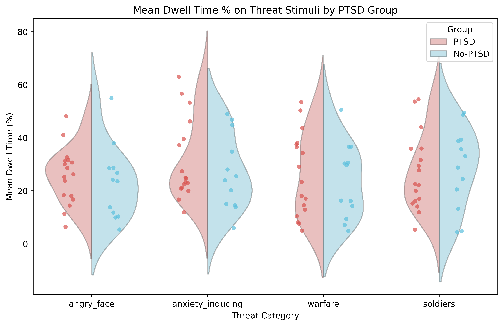
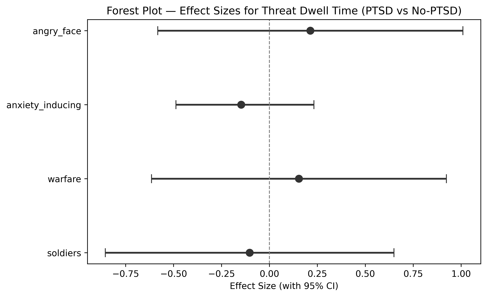
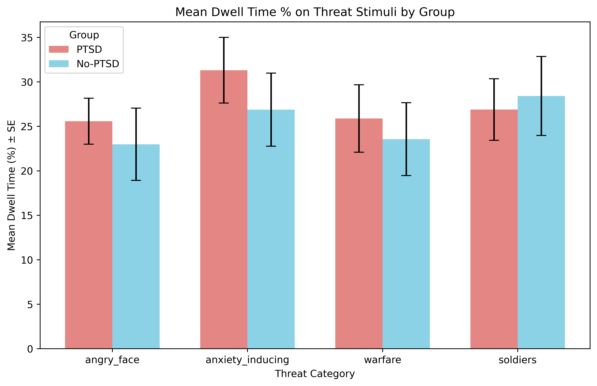

# H1: Threat Stimulus Dwell Time by PTSD Group

**Notebook**: `hypotheses_testing/h1_threat_dwell_time.py`

## Hypothesis

**H1**: Participants in the PTSD group will show higher mean dwell time percentage on threat stimuli than the no-PTSD group across pre-defined threat categories.

## Method

- **Participants**: 29 total (17 PTSD, 12 no-PTSD)
- **Dependent variables**: `mean_dwell_pct_{category}` for 4 threat categories: angry_face, anxiety_inducing, warfare, soldiers
- **Group variable**: `if_PTSD` (1 = PTSD, 0 = no-PTSD)
- **Test family**: 4 comparisons (one per threat category)

### Test selection logic

For each category:
1. **Shapiro-Wilk** test on each group (α = 0.05)
2. **Levene's test** for equality of variances (α = 0.05)
3. If both groups pass normality AND equal variance: **Student's t-test**
4. If both groups pass normality BUT unequal variance: **Welch's t-test**
5. If either group fails normality: **Mann-Whitney U test**

### Effect sizes

- **Cohen's d** for Student's and Welch's t-tests (with pooled SD)
- **Rank-biserial r** for Mann-Whitney U (computed from U statistic)
- 95% confidence intervals for all effect sizes

### Multiple comparison correction

Benjamini-Hochberg (FDR) applied across the 4 p-values.

## Results

### Descriptive statistics

| Category         | Group   |  n |   Mean |     SD | Median |    Min |    Max |
|------------------|---------|---:|-------:|-------:|-------:|-------:|-------:|
| angry_face       | PTSD    | 17 | 25.573 | 10.636 | 26.206 |  6.400 | 48.105 |
| angry_face       | No-PTSD | 12 | 22.983 | 14.064 | 23.863 |  5.397 | 54.946 |
| anxiety_inducing | PTSD    | 17 | 31.307 | 15.205 | 24.761 | 11.903 | 63.041 |
| anxiety_inducing | No-PTSD | 12 | 26.870 | 14.228 | 24.711 |  5.968 | 48.956 |
| warfare          | PTSD    | 17 | 25.877 | 15.643 | 23.284 |  4.999 | 53.427 |
| warfare          | No-PTSD | 12 | 23.556 | 14.178 | 23.021 |  4.942 | 50.579 |
| soldiers         | PTSD    | 17 | 26.891 | 14.268 | 22.504 |  5.330 | 54.519 |
| soldiers         | No-PTSD | 12 | 28.412 | 15.384 | 30.925 |  4.345 | 49.465 |

### Assumption checks

| Category         | Shapiro PTSD (W, p) | Shapiro No-PTSD (W, p) | Levene (F, p) | Both Normal | Equal Var |
|------------------|---------------------|------------------------|---------------|:-----------:|:---------:|
| angry_face       | 0.976, 0.914        | 0.916, 0.253           | 0.652, 0.426  | Yes         | Yes       |
| anxiety_inducing | 0.872, **0.024**    | 0.931, 0.387           | 0.002, 0.967  | **No**      | Yes       |
| warfare          | 0.931, 0.229        | 0.934, 0.427           | 0.234, 0.633  | Yes         | Yes       |
| soldiers         | 0.940, 0.323        | 0.941, 0.514           | 0.116, 0.736  | Yes         | Yes       |

The PTSD group's anxiety_inducing dwell times were non-normal (Shapiro p = 0.024), triggering the Mann-Whitney U test for that category.

### Primary results (BH-corrected)

| Category         | Test             | Statistic | p (uncorr) | p (BH)  | Effect Size       | 95% CI            | Significant |
|------------------|------------------|----------:|------------|---------|-------------------|-------------------|:-----------:|
| angry_face       | Student's t-test |     0.566 | 0.576      | 0.786   | d = 0.213         | [−0.583, 1.009]   | No          |
| anxiety_inducing | Mann-Whitney U   |   117.000 | 0.521      | 0.786   | r = −0.147        | [−0.487, 0.232]   | No          |
| warfare          | Student's t-test |     0.409 | 0.686      | 0.786   | d = 0.154         | [−0.615, 0.923]   | No          |
| soldiers         | Student's t-test |    −0.274 | 0.786      | 0.786   | d = −0.103        | [−0.856, 0.650]   | No          |

**No category reached significance after BH correction** (all p_BH = 0.786).

### Secondary results (uncorrected)

Even without multiple comparison correction, no category reached significance (all uncorrected p > 0.52). The largest uncorrected effect was for anxiety_inducing (p = 0.521) and angry_face (p = 0.576).

### Figures

#### Violin + strip plot

#### Forest plot — effect sizes

#### Bar chart — group means ± SE

## Conclusion

**H1 is NOT supported.** There were no statistically significant differences in mean dwell time percentage on threat stimuli between the PTSD and no-PTSD groups for any of the four threat categories (angry_face, anxiety_inducing, warfare, soldiers), either before or after Benjamini-Hochberg correction.

Effect sizes were uniformly small (|d| ≤ 0.21, |r| ≤ 0.15) and all 95% confidence intervals included zero, indicating no meaningful group difference in attentional engagement with threat stimuli as measured by dwell time.

### Caveats

- **Small sample size**: With n = 17 (PTSD) and n = 12 (no-PTSD), statistical power is limited. A post-hoc power analysis would likely confirm insufficient power to detect small-to-medium effects.
- **Non-normality**: The anxiety_inducing category showed non-normal dwell times in the PTSD group, requiring a non-parametric test. This may reflect heterogeneity in response patterns.
- **Multiple testing**: The BH correction is conservative relative to uncorrected comparisons but liberal relative to Bonferroni. Neither approach changes the conclusion here, as no uncorrected p-values approached significance.
