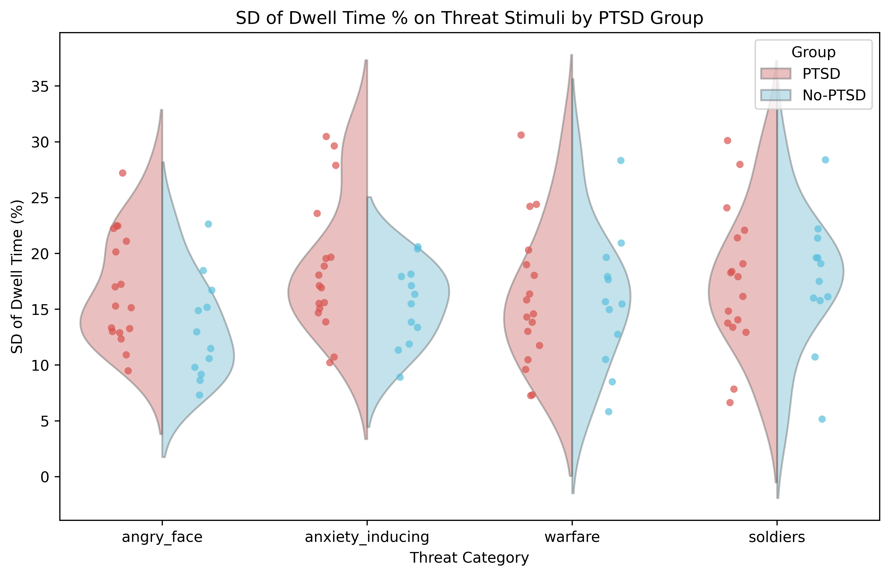
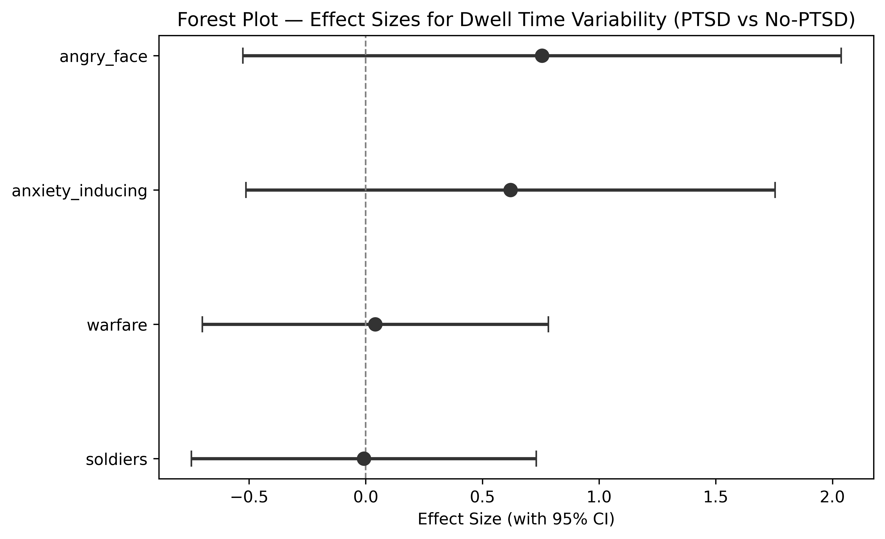
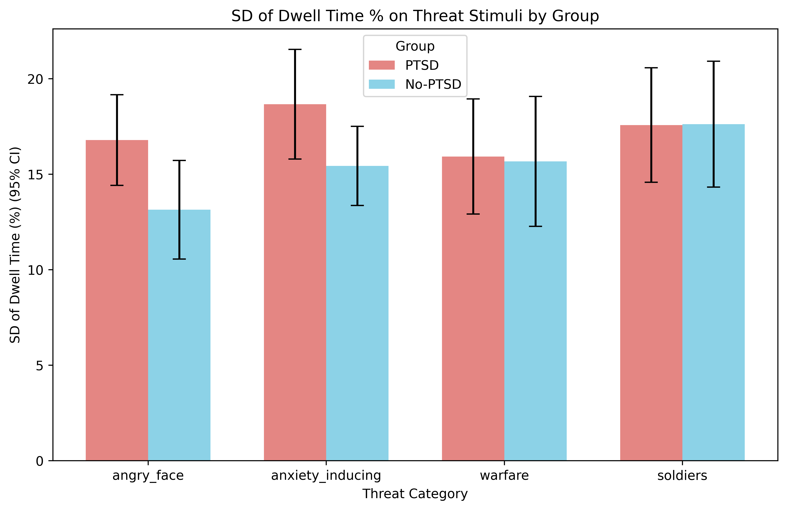

# H2: Attention Bias Variability by PTSD Group

**Notebook**: `hypotheses_testing/h2_threat_dwell_variability.py`

## Hypothesis

**H2**: Participants in the PTSD group will show higher within-participant variability (standard deviation) of dwell time percentage on threat stimuli than the no-PTSD group across pre-defined threat categories. Higher variability may indicate attentional dysregulation — an unstable pattern of engagement/disengagement with threat.

## Method

- **Participants**: 29 total (17 PTSD, 12 no-PTSD)
- **Dependent variables**: `std_dwell_pct_{category}` for 4 threat categories: angry_face, anxiety_inducing, warfare, soldiers
- **Group variable**: `if_PTSD` (1 = PTSD, 0 = no-PTSD)
- **Test family**: 4 comparisons (one per threat category)

### Test selection logic

For each category:
1. **Shapiro-Wilk** test on each group (α = 0.05)
2. **Levene's test** for equality of variances (α = 0.05)
3. If both groups pass normality AND equal variance: **Student's t-test**
4. If both groups pass normality BUT unequal variance: **Welch's t-test**
5. If either group fails normality: **Mann-Whitney U test**

### Effect sizes

- **Cohen's d** for Student's and Welch's t-tests (with pooled SD)
- **Rank-biserial r** for Mann-Whitney U (computed from U statistic)
- 95% confidence intervals for all effect sizes

### Multiple comparison correction

Benjamini-Hochberg (FDR) applied across the 4 p-values.

## Results

### Descriptive statistics

| Category         | Group   |  n |   Mean |     SD | Median |    Min |    Max |
|------------------|---------|---:|-------:|-------:|-------:|-------:|-------:|
| angry_face       | PTSD    | 17 | 16.785 |  4.997 | 15.277 |  9.472 | 27.196 |
| angry_face       | No-PTSD | 12 | 13.140 |  4.563 | 12.220 |  7.300 | 22.622 |
| anxiety_inducing | PTSD    | 17 | 18.663 |  6.033 | 17.099 | 10.205 | 30.466 |
| anxiety_inducing | No-PTSD | 12 | 15.437 |  3.661 | 15.903 |  8.898 | 20.589 |
| warfare          | PTSD    | 17 | 15.926 |  6.338 | 14.571 |  7.249 | 30.599 |
| warfare          | No-PTSD | 12 | 15.670 |  6.008 | 15.561 |  5.810 | 28.318 |
| soldiers         | PTSD    | 17 | 17.571 |  6.306 | 17.910 |  6.625 | 30.104 |
| soldiers         | No-PTSD | 12 | 17.619 |  5.818 | 18.285 |  5.145 | 28.378 |

### Assumption checks

| Category         | Shapiro PTSD (W, p) | Shapiro No-PTSD (W, p) | Levene (F, p) | Both Normal | Equal Var |
|------------------|---------------------|------------------------|---------------|:-----------:|:---------:|
| angry_face       | 0.939, 0.307        | 0.947, 0.592           | 0.153, 0.699  | Yes         | Yes       |
| anxiety_inducing | 0.909, 0.097        | 0.967, 0.875           | 1.179, 0.287  | Yes         | Yes       |
| warfare          | 0.953, 0.505        | 0.976, 0.959           | 0.077, 0.784  | Yes         | Yes       |
| soldiers         | 0.972, 0.857        | 0.949, 0.616           | 0.239, 0.629  | Yes         | Yes       |

All groups passed both normality and equal-variance assumptions, so Student's t-test was used for all four categories.

### Primary results (BH-corrected)

| Category         | Test             | Statistic | p (uncorr) | p (BH)  | Effect Size       | 95% CI            | Significant |
|------------------|------------------|----------:|------------|---------|-------------------|-------------------|:-----------:|
| angry_face       | Student's t-test |     2.004 | 0.055      | 0.221   | d = 0.756         | [−0.526, 2.037]   | No          |
| anxiety_inducing | Student's t-test |     1.646 | 0.111      | 0.223   | d = 0.621         | [−0.513, 1.755]   | No          |
| warfare          | Student's t-test |     0.109 | 0.914      | 0.984   | d = 0.041         | [−0.700, 0.782]   | No          |
| soldiers         | Student's t-test |    −0.021 | 0.984      | 0.984   | d = −0.008        | [−0.747, 0.731]   | No          |

**No category reached significance after BH correction** (all p_BH ≥ 0.221).

### Secondary results (uncorrected)

Even without multiple comparison correction, no category reached significance at α = 0.05. The closest was angry_face (p = 0.055), which showed a medium-to-large effect size (d = 0.76) that was marginally non-significant. The anxiety_inducing category also showed a medium effect (d = 0.62, p = 0.111). Warfare and soldiers showed negligible effects (|d| < 0.05).

### Figures

#### Violin + strip plot

#### Forest plot — effect sizes

#### Bar chart — group means (95% CI)

## Conclusion

**H2 is NOT supported.** There were no statistically significant differences in within-participant dwell time variability on threat stimuli between the PTSD and no-PTSD groups for any of the four threat categories, either before or after Benjamini-Hochberg correction.

However, unlike H1 (which found uniformly small effects), H2 revealed a notable pattern: the angry_face and anxiety_inducing categories showed medium-to-large effect sizes (d = 0.76 and d = 0.62, respectively), with the PTSD group exhibiting higher variability. The angry_face comparison approached significance at the uncorrected level (p = 0.055). This directional pattern — greater attentional instability toward emotionally salient threat stimuli — is consistent with the attentional dysregulation framework, but the current sample lacks sufficient power to confirm the effect.

### Caveats

- **Small sample size**: With n = 17 (PTSD) and n = 12 (no-PTSD), statistical power is limited. The medium-to-large effect sizes for angry_face and anxiety_inducing suggest that a larger sample might detect significant differences.
- **Multiple testing**: BH correction substantially increased p-values for the two trending categories (0.055 → 0.221, 0.111 → 0.223), moving them further from significance.
- **Variability as a DV**: Within-participant SD of dwell time may be influenced by the number of trials per category. If trial counts vary across participants or categories, this could introduce noise into the variability estimates.
