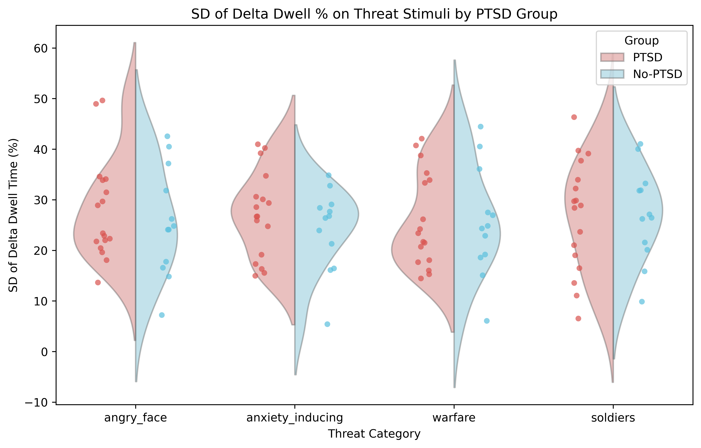
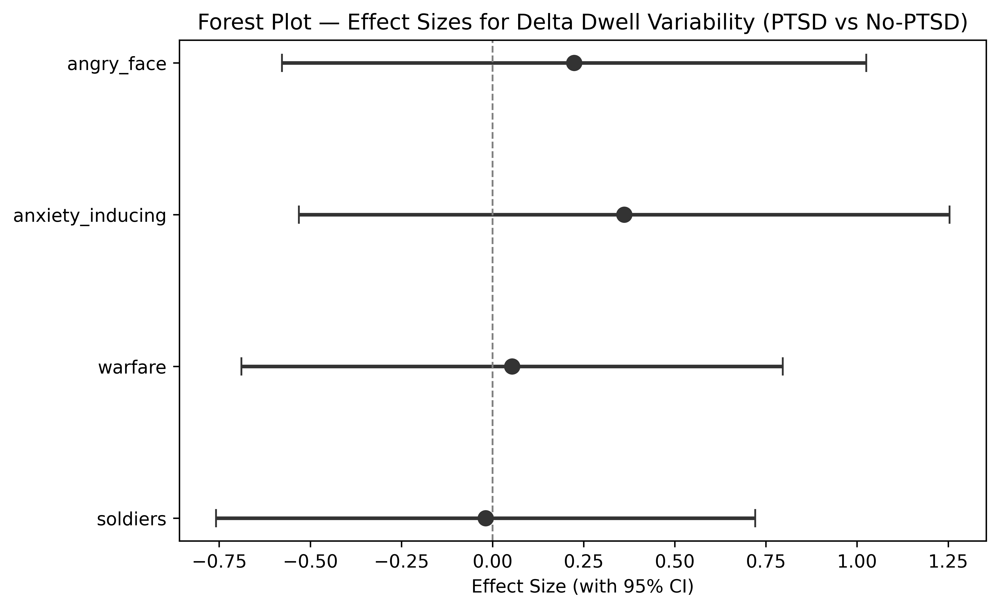
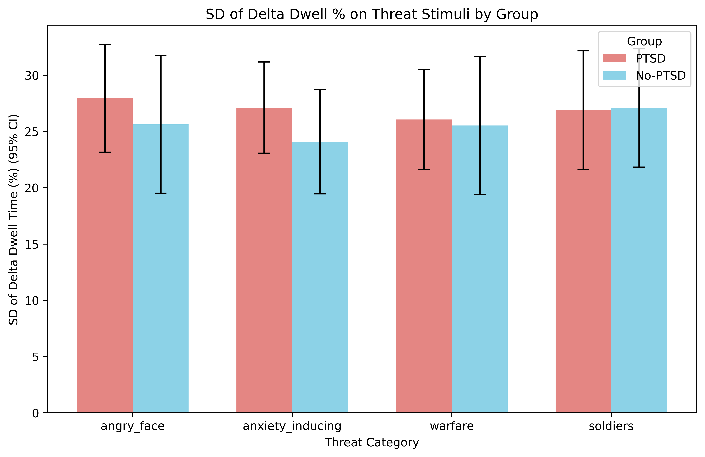

# H3: Attention Bias Variability (Delta) by PTSD Group

**Notebook**: `hypotheses_testing/h3_attention_bias_variability.py`

## Hypothesis

**H3**: Participants in the PTSD group will show higher across-slide variability of the attention bias score (delta between threat and paired baseline dwell time percentage) than the no-PTSD group. Higher delta variability indicates inconsistent attentional bias — fluctuating between vigilance and avoidance of threat across presentations.

## Method

- **Participants**: 29 total (17 PTSD, 12 no-PTSD)
- **Dependent variables**: `std_delta_dwell_pct_{category}` for 4 threat categories: angry_face, anxiety_inducing, warfare, soldiers
- **Group variable**: `if_PTSD` (1 = PTSD, 0 = no-PTSD)
- **Test family**: 4 comparisons (one per threat category)

### Test selection logic

For each category:
1. **Shapiro-Wilk** test on each group (α = 0.05)
2. **Levene's test** for equality of variances (α = 0.05)
3. If both groups pass normality AND equal variance: **Student's t-test**
4. If both groups pass normality BUT unequal variance: **Welch's t-test**
5. If either group fails normality: **Mann-Whitney U test**

### Effect sizes

- **Cohen's d** for Student's and Welch's t-tests (with pooled SD)
- **Rank-biserial r** for Mann-Whitney U (computed from U statistic)
- 95% confidence intervals for all effect sizes

### Multiple comparison correction

Benjamini-Hochberg (FDR) applied across the 4 p-values.

## Results

### Descriptive statistics

| Category         | Group   |  n |   Mean |     SD | Median |    Min |    Max |
|------------------|---------|---:|-------:|-------:|-------:|-------:|-------:|
| angry_face       | PTSD    | 17 | 27.952 | 10.077 | 23.381 | 13.640 | 49.626 |
| angry_face       | No-PTSD | 12 | 25.630 | 10.806 | 24.451 |  7.210 | 42.545 |
| anxiety_inducing | PTSD    | 17 | 27.118 |  8.520 | 26.718 | 14.967 | 40.969 |
| anxiety_inducing | No-PTSD | 12 | 24.088 |  8.198 | 26.578 |  5.404 | 34.843 |
| warfare          | PTSD    | 17 | 26.067 |  9.348 | 23.383 | 14.447 | 42.076 |
| warfare          | No-PTSD | 12 | 25.533 | 10.813 | 24.577 |  6.061 | 44.457 |
| soldiers         | PTSD    | 17 | 26.892 | 11.094 | 28.871 |  6.520 | 46.328 |
| soldiers         | No-PTSD | 12 | 27.091 |  9.285 | 26.772 |  9.859 | 41.034 |

### Assumption checks

| Category         | Shapiro PTSD (W, p) | Shapiro No-PTSD (W, p) | Levene (F, p) | Both Normal | Equal Var |
|------------------|---------------------|------------------------|---------------|:-----------:|:---------:|
| angry_face       | 0.896, 0.058        | 0.963, 0.822           | 0.037, 0.850  | Yes         | Yes       |
| anxiety_inducing | 0.933, 0.248        | 0.922, 0.307           | 0.158, 0.695  | Yes         | Yes       |
| warfare          | 0.905, 0.083        | 0.969, 0.898           | 0.012, 0.915  | Yes         | Yes       |
| soldiers         | 0.978, 0.936        | 0.972, 0.930           | 0.493, 0.489  | Yes         | Yes       |

All groups passed both normality and equal-variance assumptions, so Student's t-test was used for all four categories.

### Primary results (BH-corrected)

| Category         | Test             | Statistic | p (uncorr) | p (BH)  | Effect Size       | 95% CI            | Significant |
|------------------|------------------|----------:|------------|---------|-------------------|-------------------|:-----------:|
| angry_face       | Student's t-test |     0.593 | 0.558      | 0.960   | d = 0.224         | [−0.578, 1.025]   | No          |
| anxiety_inducing | Student's t-test |     0.958 | 0.347      | 0.960   | d = 0.361         | [−0.531, 1.254]   | No          |
| warfare          | Student's t-test |     0.142 | 0.888      | 0.960   | d = 0.054         | [−0.689, 0.796]   | No          |
| soldiers         | Student's t-test |    −0.051 | 0.960      | 0.960   | d = −0.019        | [−0.759, 0.720]   | No          |

**No category reached significance after BH correction** (all p_BH = 0.960).

### Secondary results (uncorrected)

Even without multiple comparison correction, no category reached significance at α = 0.05. The largest effect was anxiety_inducing (d = 0.36, p = 0.347), a small effect. Angry_face showed a similar small effect (d = 0.22, p = 0.558). Warfare and soldiers showed negligible effects (|d| < 0.06).

### Figures

#### Violin + strip plot

#### Forest plot — effect sizes

#### Bar chart — group means (95% CI)

## Conclusion

**H3 is NOT supported.** There were no statistically significant differences in the variability of attention bias scores (delta dwell) between the PTSD and no-PTSD groups for any of the four threat categories, either before or after Benjamini-Hochberg correction.

All effect sizes were small (|d| ≤ 0.36), and all uncorrected p-values were well above 0.05. Unlike H2, where angry_face and anxiety_inducing showed medium-to-large effects (d = 0.76 and 0.62), the delta-based variability measure produced substantially weaker group differences. This suggests that while the PTSD group may show somewhat more variable raw dwell time on certain threat stimuli (H2 trend), the variability of the *relative bias* (threat minus baseline) does not differ meaningfully between groups.

### Caveats

- **Small sample size**: With n = 17 (PTSD) and n = 12 (no-PTSD), statistical power is limited, though the uniformly small effect sizes suggest that even a larger sample is unlikely to reveal a strong effect for this operationalisation.
- **Multiple testing**: BH correction pushed all p-values to 0.960, but even uncorrected p-values were far from significance.
- **Delta computation**: The delta score (threat − baseline) may cancel out individual differences in overall dwell time, potentially masking group effects that are visible in raw dwell variability (H2).
