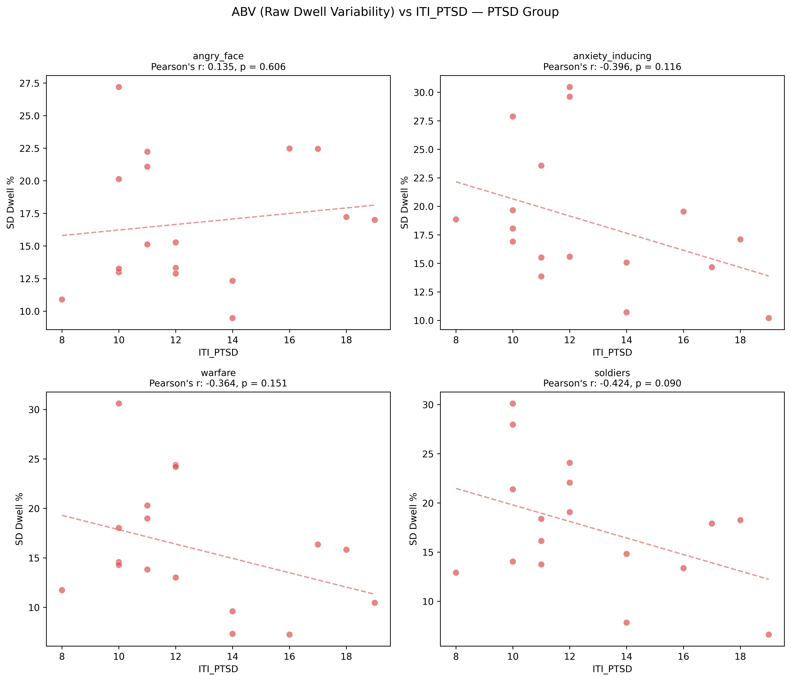
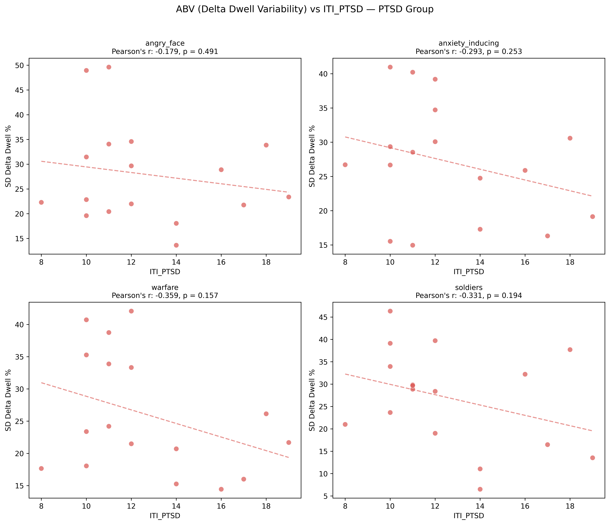
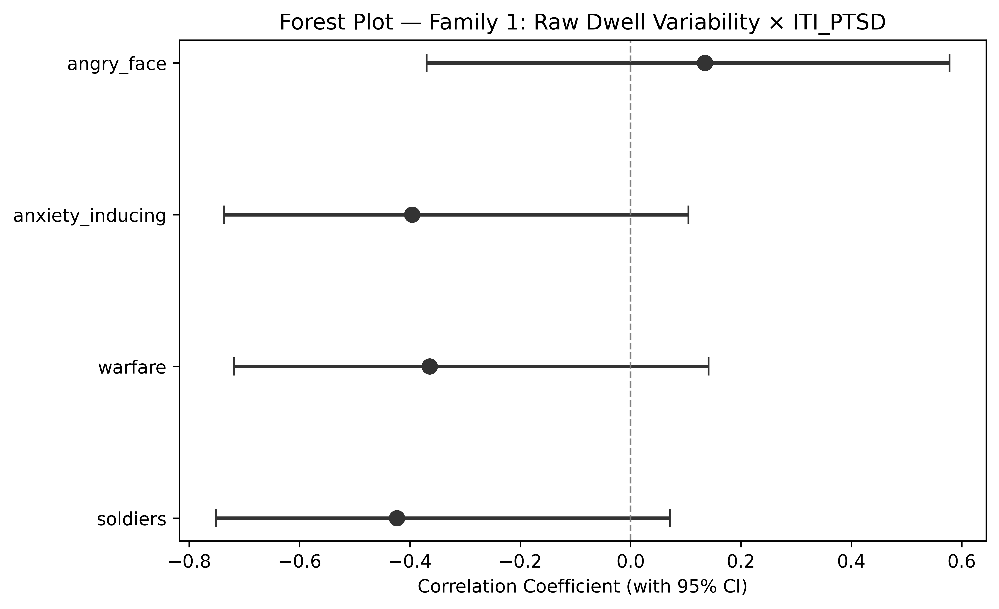
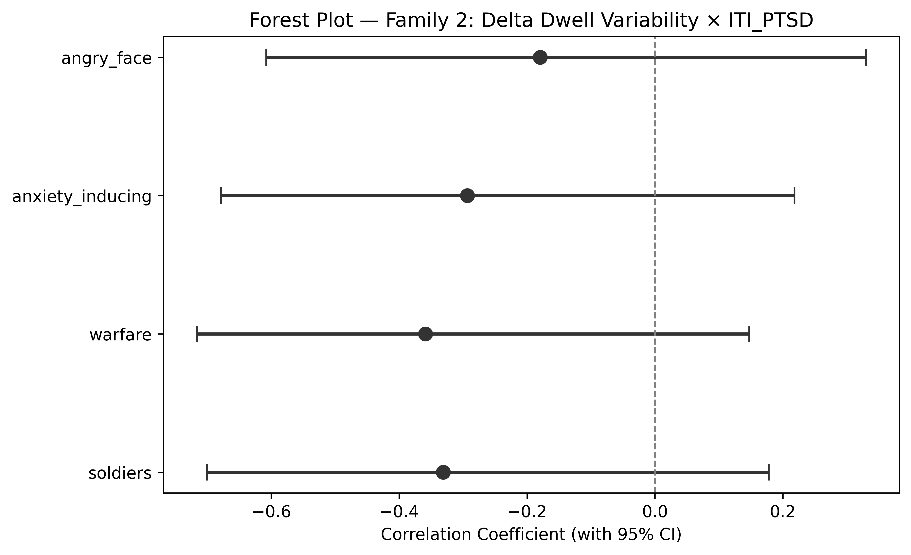
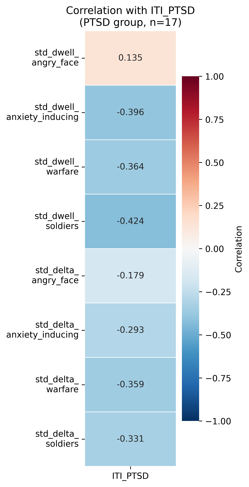

# H4: ABV × ITI PTSD Severity Correlation

**Notebook**: `hypotheses_testing/h4_abv_iti_correlation.py`

## Hypothesis

**H4**: Attention bias variability (ABV) metrics — `std_dwell_pct_{threat}` and `std_delta_dwell_pct_{threat}` — will show positive associations with PTSD symptom severity (`ITI_PTSD`) within the PTSD group (n=17).

## Method

- **Participants**: 17 (PTSD group only; ITI scores are only meaningful for this group)
- **Independent variable**: `ITI_PTSD` (PTSD symptom severity, range 8–19)
- **Dependent variables**: 8 ABV metrics across 2 families:
  - **Family 1** (raw dwell variability): `std_dwell_pct_{category}` for angry_face, anxiety_inducing, warfare, soldiers
  - **Family 2** (delta dwell variability): `std_delta_dwell_pct_{category}` for the same 4 categories
- **Test families**: 2 families of 4 tests each

### Test selection logic

For each DV:
1. **Shapiro-Wilk** test on both the DV and `ITI_PTSD` (α = 0.05)
2. **Outlier detection**: Standardized residuals from OLS regression (DV ~ IV); observations with |z| > 3 flagged as outliers
3. If both variables pass normality **and** no outliers detected: **Pearson's r** (CI via Fisher z transformation)
4. If either variable fails normality **or** outliers are present: **Kendall's τ_b** (CI via bootstrap, 10,000 resamples) — preferred over Spearman for n < 20 due to better small-sample properties and tie handling
5. **Homoscedasticity**: Assessed visually via residual-vs-fitted plots with LOWESS smoother (reported for transparency, not used as a decision criterion — formal tests are underpowered at n=17)

### Multiple comparison correction

Benjamini-Hochberg (FDR) applied **separately** within each family of 4 p-values.

## Results

### Descriptive statistics

| Variable                              |  n |   Mean |     SD | Median |    Min |    Max |
|---------------------------------------|---:|-------:|-------:|-------:|-------:|-------:|
| ITI_PTSD                              | 17 | 12.647 |  3.181 | 12.000 |  8.000 | 19.000 |
| std_dwell_pct_angry_face              | 17 | 16.785 |  4.997 | 15.277 |  9.472 | 27.196 |
| std_dwell_pct_anxiety_inducing        | 17 | 18.663 |  6.033 | 17.099 | 10.205 | 30.466 |
| std_dwell_pct_warfare                 | 17 | 15.926 |  6.338 | 14.571 |  7.249 | 30.599 |
| std_dwell_pct_soldiers                | 17 | 17.571 |  6.306 | 17.910 |  6.625 | 30.104 |
| std_delta_dwell_pct_angry_face        | 17 | 27.952 | 10.077 | 23.381 | 13.640 | 49.626 |
| std_delta_dwell_pct_anxiety_inducing  | 17 | 27.118 |  8.520 | 26.718 | 14.967 | 40.969 |
| std_delta_dwell_pct_warfare           | 17 | 26.067 |  9.348 | 23.383 | 14.447 | 42.076 |
| std_delta_dwell_pct_soldiers          | 17 | 26.892 | 11.094 | 28.871 |  6.520 | 46.328 |

### Assumption checks

| DV                                    | Shapiro W | Shapiro p | DV Normal | IV Normal | Both Normal | N Outliers | Has Outliers | Use Pearson |
|---------------------------------------|----------:|----------:|:---------:|:---------:|:-----------:|:----------:|:------------:|:-----------:|
| ITI_PTSD (IV)                         |     0.905 |     0.082 |     —     |    Yes    |      —      |     —      |       —      |      —      |
| std_dwell_pct_angry_face              |     0.939 |     0.307 |    Yes    |    Yes    |     Yes     |     0      |      No      |     Yes     |
| std_dwell_pct_anxiety_inducing        |     0.909 |     0.097 |    Yes    |    Yes    |     Yes     |     0      |      No      |     Yes     |
| std_dwell_pct_warfare                 |     0.953 |     0.505 |    Yes    |    Yes    |     Yes     |     0      |      No      |     Yes     |
| std_dwell_pct_soldiers                |     0.972 |     0.857 |    Yes    |    Yes    |     Yes     |     0      |      No      |     Yes     |
| std_delta_dwell_pct_angry_face        |     0.896 |     0.058 |    Yes    |    Yes    |     Yes     |     0      |      No      |     Yes     |
| std_delta_dwell_pct_anxiety_inducing  |     0.933 |     0.248 |    Yes    |    Yes    |     Yes     |     0      |      No      |     Yes     |
| std_delta_dwell_pct_warfare           |     0.905 |     0.083 |    Yes    |    Yes    |     Yes     |     0      |      No      |     Yes     |
| std_delta_dwell_pct_soldiers          |     0.978 |     0.936 |    Yes    |    Yes    |     Yes     |     0      |      No      |     Yes     |

All variables passed the Shapiro-Wilk normality test at α = 0.05, and no outliers were detected (standardized OLS residuals, |z| > 3 threshold). Pearson's r was used for all 8 correlations.

### Primary results — Family 1: Raw Dwell Variability (BH-corrected)

| Category         | Test        |      r | p (uncorr) | p (BH) | 95% CI              | Significant |
|------------------|-------------|-------:|------------|--------|---------------------|:-----------:|
| angry_face       | Pearson's r |  0.135 | 0.606      | 0.606  | [−0.370, 0.578]     | No          |
| anxiety_inducing | Pearson's r | −0.396 | 0.116      | 0.201  | [−0.736, 0.105]     | No          |
| warfare          | Pearson's r | −0.364 | 0.151      | 0.201  | [−0.719, 0.141]     | No          |
| soldiers         | Pearson's r | −0.424 | 0.090      | 0.201  | [−0.751, 0.072]     | No          |

### Primary results — Family 2: Delta Dwell Variability (BH-corrected)

| Category         | Test        |      r | p (uncorr) | p (BH) | 95% CI              | Significant |
|------------------|-------------|-------:|------------|--------|---------------------|:-----------:|
| angry_face       | Pearson's r | −0.179 | 0.491      | 0.491  | [−0.608, 0.330]     | No          |
| anxiety_inducing | Pearson's r | −0.293 | 0.253      | 0.338  | [−0.678, 0.218]     | No          |
| warfare          | Pearson's r | −0.359 | 0.157      | 0.338  | [−0.716, 0.147]     | No          |
| soldiers         | Pearson's r | −0.331 | 0.194      | 0.338  | [−0.700, 0.178]     | No          |

**No correlation reached significance after BH correction in either family.**

### Secondary results (uncorrected)

Even without multiple comparison correction, no correlation reached significance at α = 0.05. The strongest associations were in Family 1: soldiers (r = −0.42, p = 0.090) and anxiety_inducing (r = −0.40, p = 0.116), both medium negative effects — opposite to the hypothesised positive direction. In Family 2, warfare showed the strongest association (r = −0.36, p = 0.157), again negative. The only positive coefficient was angry_face in Family 1 (r = 0.13, p = 0.606), a negligible effect.

### Figures

#### Scatterplots — Family 1 (raw dwell variability)

#### Scatterplots — Family 2 (delta dwell variability)

#### Forest plot — Family 1

#### Forest plot — Family 2

#### Correlation heatmap

#### Outlier inspection

#### Homoscedasticity inspection

## Conclusion

**H4 is NOT supported.** There were no statistically significant correlations between attention bias variability (ABV) and PTSD symptom severity (ITI_PTSD) within the PTSD group, in either family of metrics, before or after Benjamini-Hochberg correction.

Notably, the direction of most associations was **negative** — contrary to the hypothesised positive relationship. Participants with higher ITI_PTSD scores tended to show slightly *lower* ABV, though none of these trends were significant. The strongest trend was soldiers in Family 1 (r = −0.42, p = 0.090), a medium effect that would require a larger sample to evaluate reliably.

### Caveats

- **Small sample size**: With n = 17, statistical power for detecting correlations is limited. A correlation of |r| ≥ 0.48 would be needed for 80% power at α = 0.05 (two-tailed), and none of the observed correlations reached this threshold.
- **Restriction of range**: The ITI_PTSD scores ranged from 8 to 19 (SD = 3.18) within the PTSD group. This restricted range may attenuate true correlations that would be visible across the full severity spectrum.
- **Direction of effects**: The predominantly negative associations suggest that if anything, higher symptom severity may be linked to *less* variable attention to threat — possibly reflecting sustained avoidance rather than fluctuating bias. This warrants investigation in a larger sample.
- **Multiple testing**: BH correction was applied separately per family (4 tests each), as planned. Pooling all 8 tests would have produced even more conservative corrections.
- **No outliers detected**: All standardized OLS residuals fell within |z| ≤ 3, confirming no influential observations biased the Pearson correlations.
- **Homoscedasticity**: Visual inspection of residual-vs-fitted plots showed no systematic patterns in residual spread, though formal testing is underpowered at this sample size.
