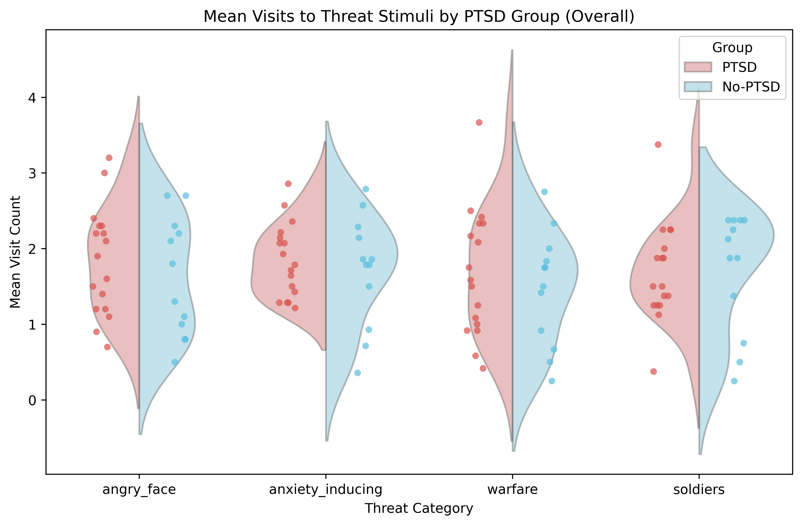
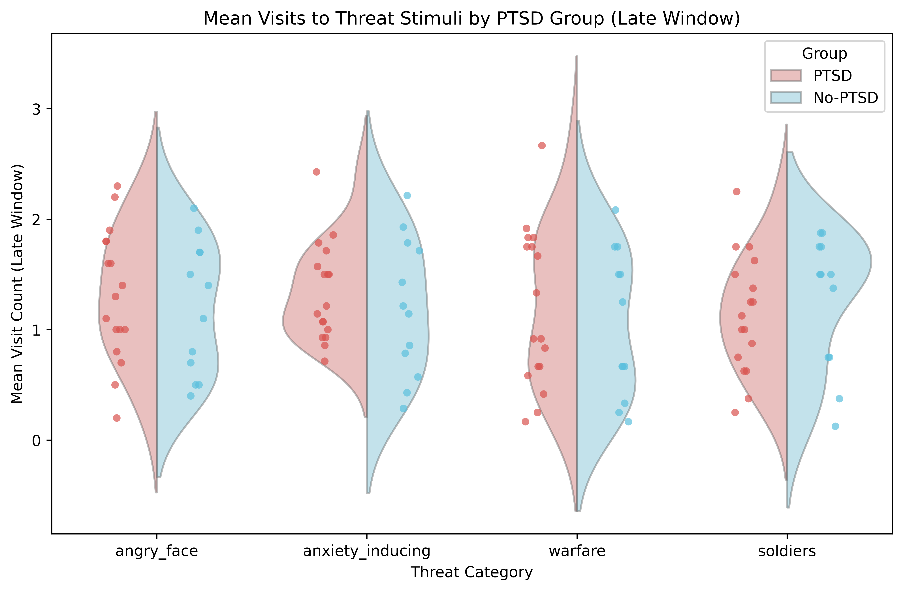
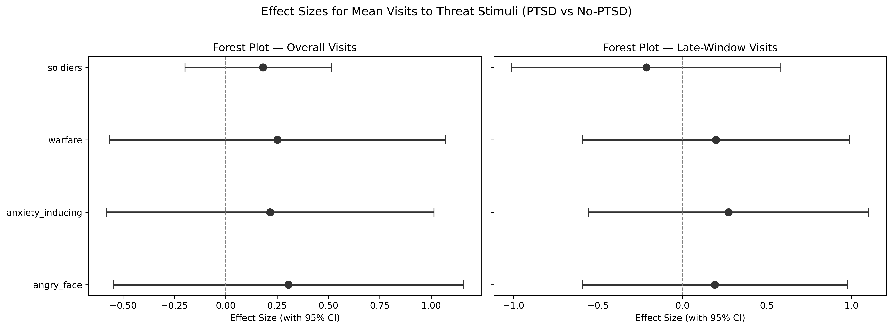
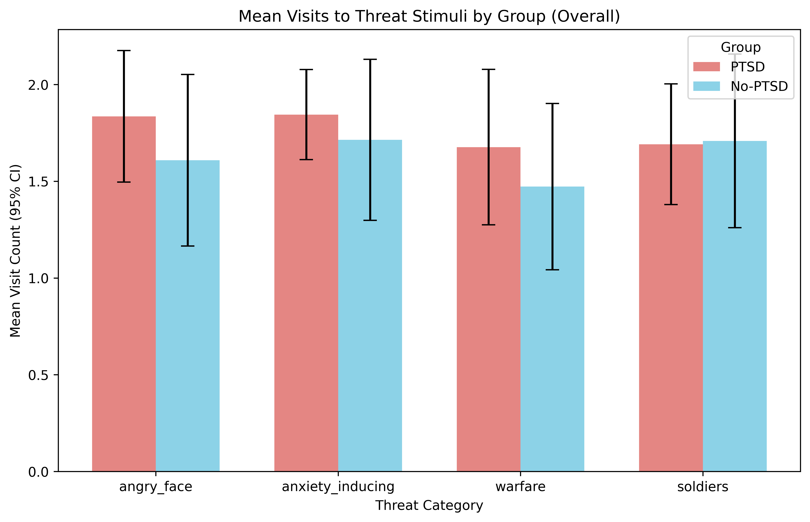
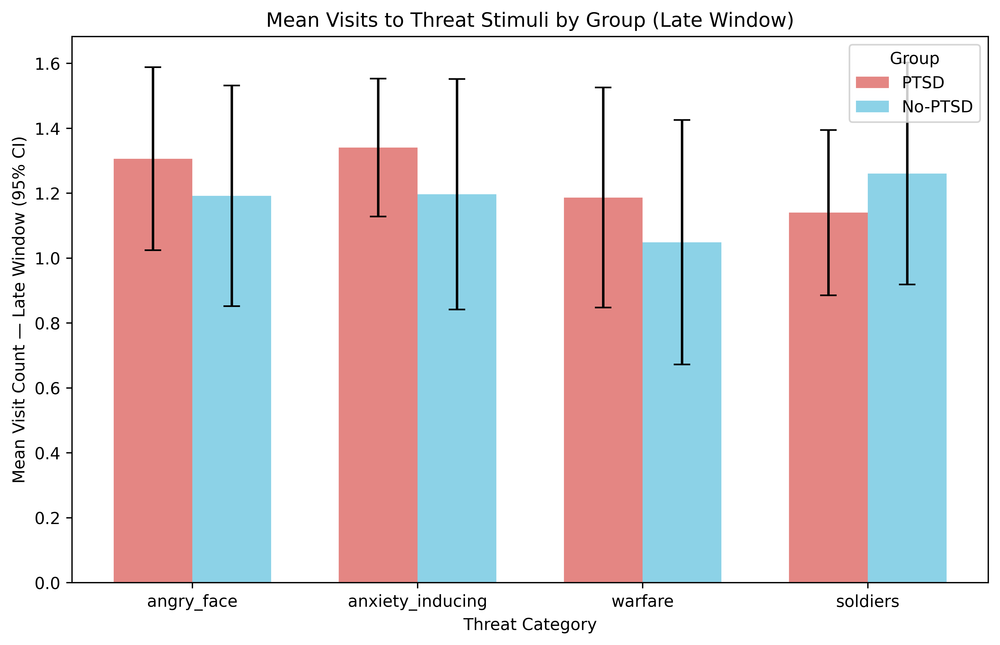

# H5: Mean Visits to Threat Stimuli by PTSD Group

**Notebook**: `hypotheses_testing/h5_mean_visits_threat.py`

## Hypothesis

**H5**: Participants in the PTSD group will show more revisits (higher mean visit count) to threat stimuli than the no-PTSD group, with combat-related categories expected to show the strongest effects. A secondary prediction is that the PTSD–no-PTSD difference is larger in the late viewing window, consistent with sustained monitoring / difficulty disengaging.

## Method

- **Participants**: 29 total (17 PTSD, 12 no-PTSD)
- **Group variable**: `if_PTSD` (1 = PTSD, 0 = no-PTSD)
- **Threat categories**: angry_face, anxiety_inducing, warfare, soldiers

### Dependent variables (two families)

| Family | DVs | Description |
|--------|-----|-------------|
| Family 1 (Overall Visits) | `mean_visits_{category}` | Mean visit count across full viewing window |
| Family 2 (Late-Window Visits) | `mean_visits_late_{category}` | Mean visit count in late viewing window |

### Test selection logic

For each DV:
1. **Shapiro-Wilk** test on each group (α = 0.05)
2. **Levene's test** for equality of variances (α = 0.05)
3. If both groups pass normality AND equal variance: **Student's t-test**
4. If both groups pass normality BUT unequal variance: **Welch's t-test**
5. If either group fails normality: **Mann-Whitney U test**

### Effect sizes

- **Cohen's d** for Student's and Welch's t-tests (with pooled SD)
- **Rank-biserial r** for Mann-Whitney U (computed from U statistic)
- 95% confidence intervals for all effect sizes

### Multiple comparison correction

Benjamini-Hochberg (FDR) applied separately within each family (4 p-values per family).

## Results

### Descriptive statistics — Family 1: Overall Visits

| Category         | Group   |  n |  Mean |    SD | Median |   Min |   Max |
|------------------|---------|---:|------:|------:|-------:|------:|------:|
| angry_face       | PTSD    | 17 | 1.835 | 0.715 |  1.900 | 0.700 | 3.200 |
| angry_face       | No-PTSD | 12 | 1.608 | 0.783 |  1.550 | 0.500 | 2.700 |
| anxiety_inducing | PTSD    | 17 | 1.845 | 0.490 |  1.786 | 1.214 | 2.857 |
| anxiety_inducing | No-PTSD | 12 | 1.714 | 0.735 |  1.821 | 0.357 | 2.786 |
| warfare          | PTSD    | 17 | 1.676 | 0.845 |  1.583 | 0.417 | 3.667 |
| warfare          | No-PTSD | 12 | 1.472 | 0.759 |  1.625 | 0.250 | 2.750 |
| soldiers         | PTSD    | 17 | 1.691 | 0.656 |  1.500 | 0.375 | 3.375 |
| soldiers         | No-PTSD | 12 | 1.708 | 0.793 |  2.000 | 0.250 | 2.375 |

### Descriptive statistics — Family 2: Late-Window Visits

| Category         | Group   |  n |  Mean |    SD | Median |   Min |   Max |
|------------------|---------|---:|------:|------:|-------:|------:|------:|
| angry_face       | PTSD    | 17 | 1.306 | 0.593 |  1.300 | 0.200 | 2.300 |
| angry_face       | No-PTSD | 12 | 1.192 | 0.601 |  1.250 | 0.400 | 2.100 |
| anxiety_inducing | PTSD    | 17 | 1.340 | 0.447 |  1.214 | 0.714 | 2.429 |
| anxiety_inducing | No-PTSD | 12 | 1.196 | 0.628 |  1.179 | 0.286 | 2.214 |
| warfare          | PTSD    | 17 | 1.186 | 0.713 |  0.917 | 0.167 | 2.667 |
| warfare          | No-PTSD | 12 | 1.049 | 0.665 |  0.958 | 0.167 | 2.083 |
| soldiers         | PTSD    | 17 | 1.140 | 0.536 |  1.125 | 0.250 | 2.250 |
| soldiers         | No-PTSD | 12 | 1.260 | 0.604 |  1.500 | 0.125 | 1.875 |

### Assumption checks

#### Family 1: Overall Visits

| Category         | Shapiro PTSD (W, p) | Shapiro No-PTSD (W, p) | Levene (F, p) | Both Normal | Equal Var |
|------------------|---------------------|------------------------|---------------|:-----------:|:---------:|
| angry_face       | 0.961, 0.650        | 0.916, 0.254           | 0.548, 0.466  | Yes         | Yes       |
| anxiety_inducing | 0.945, 0.381        | 0.949, 0.626           | 0.881, 0.356  | Yes         | Yes       |
| warfare          | 0.951, 0.478        | 0.967, 0.871           | 0.223, 0.640  | Yes         | Yes       |
| soldiers         | 0.931, 0.227        | 0.812, **0.013**       | 0.381, 0.543  | **No**      | Yes       |

The no-PTSD group's soldiers visits were non-normal (Shapiro p = 0.013), triggering the Mann-Whitney U test for that category.

#### Family 2: Late-Window Visits

| Category         | Shapiro PTSD (W, p) | Shapiro No-PTSD (W, p) | Levene (F, p) | Both Normal | Equal Var |
|------------------|---------------------|------------------------|---------------|:-----------:|:---------:|
| angry_face       | 0.978, 0.934        | 0.920, 0.281           | 0.113, 0.740  | Yes         | Yes       |
| anxiety_inducing | 0.937, 0.283        | 0.961, 0.800           | 1.960, 0.173  | Yes         | Yes       |
| warfare          | 0.934, 0.257        | 0.913, 0.230           | 0.008, 0.931  | Yes         | Yes       |
| soldiers         | 0.984, 0.983        | 0.864, 0.054           | 0.023, 0.881  | Yes         | Yes       |

All late-window DVs passed both normality and equal-variance assumptions; Student's t-tests were used throughout.

### Primary results — Family 1: Overall Visits (BH-corrected)

| Category         | Test             | Statistic | p (uncorr) | p (BH)  | Effect Size       | 95% CI            | Significant |
|------------------|------------------|----------:|------------|---------|-------------------|-------------------|:-----------:|
| angry_face       | Student's t-test |     0.810 | 0.425      | 0.571   | d = 0.305         | [−0.546, 1.157]   | No          |
| anxiety_inducing | Student's t-test |     0.574 | 0.571      | 0.571   | d = 0.216         | [−0.581, 1.014]   | No          |
| warfare          | Student's t-test |     0.668 | 0.510      | 0.571   | d = 0.252         | [−0.565, 1.069]   | No          |
| soldiers         | Mann-Whitney U   |    83.500 | 0.423      | 0.571   | r = 0.181         | [−0.198, 0.514]   | No          |

**No category reached significance after BH correction** (all p_BH = 0.571).

### Primary results — Family 2: Late-Window Visits (BH-corrected)

| Category         | Test             | Statistic | p (uncorr) | p (BH)  | Effect Size       | 95% CI            | Significant |
|------------------|------------------|----------:|------------|---------|-------------------|-------------------|:-----------:|
| angry_face       | Student's t-test |     0.508 | 0.616      | 0.616   | d = 0.192         | [−0.594, 0.977]   | No          |
| anxiety_inducing | Student's t-test |     0.722 | 0.476      | 0.616   | d = 0.272         | [−0.557, 1.102]   | No          |
| warfare          | Student's t-test |     0.526 | 0.603      | 0.616   | d = 0.198         | [−0.590, 0.987]   | No          |
| soldiers         | Student's t-test |    −0.567 | 0.575      | 0.616   | d = −0.214        | [−1.010, 0.582]   | No          |

**No category reached significance after BH correction** (all p_BH = 0.616).

### Secondary results (uncorrected)

Even without multiple comparison correction, no category in either family reached significance (all uncorrected p > 0.42). The largest uncorrected effect in Family 1 was angry_face (p = 0.425, d = 0.305); in Family 2 it was anxiety_inducing (p = 0.476, d = 0.272).

The secondary prediction that late-window differences would be larger than overall differences was also not supported — effect sizes in Family 2 were comparable to or smaller than those in Family 1.

### Figures

#### Violin + strip plot — Overall Visits

#### Violin + strip plot — Late-Window Visits

#### Forest plot — effect sizes (both families)

#### Bar chart — Overall Visits (95% CI)

#### Bar chart — Late-Window Visits (95% CI)

## Conclusion

**H5 is NOT supported.** There were no statistically significant differences in mean visit counts to threat stimuli between the PTSD and no-PTSD groups for any of the four threat categories, in either the overall or late viewing window, before or after Benjamini-Hochberg correction.

Effect sizes were uniformly small (|d| ≤ 0.31, |r| ≤ 0.18) and all 95% confidence intervals included zero, indicating no meaningful group difference in revisitation behavior to threat stimuli.

The secondary prediction — that group differences would be amplified in the late viewing window — was not confirmed. Late-window effect sizes were comparable to or smaller than overall effect sizes, providing no evidence for sustained monitoring or difficulty disengaging in the PTSD group.

### Caveats

- **Small sample size**: With n = 17 (PTSD) and n = 12 (no-PTSD), statistical power is limited. A post-hoc power analysis would likely confirm insufficient power to detect small-to-medium effects.
- **Non-normality**: The no-PTSD group's soldiers visit counts (Family 1) were non-normal (Shapiro p = 0.013), requiring a non-parametric test for that comparison. All other DVs met normality assumptions.
- **Multiple testing**: BH correction was applied separately within each family (4 tests each). Neither approach changes the conclusion here, as no uncorrected p-values approached significance.
- **Visit count metric**: Mean visit counts may have limited variance and floor/ceiling effects depending on trial structure, which could attenuate group differences.
