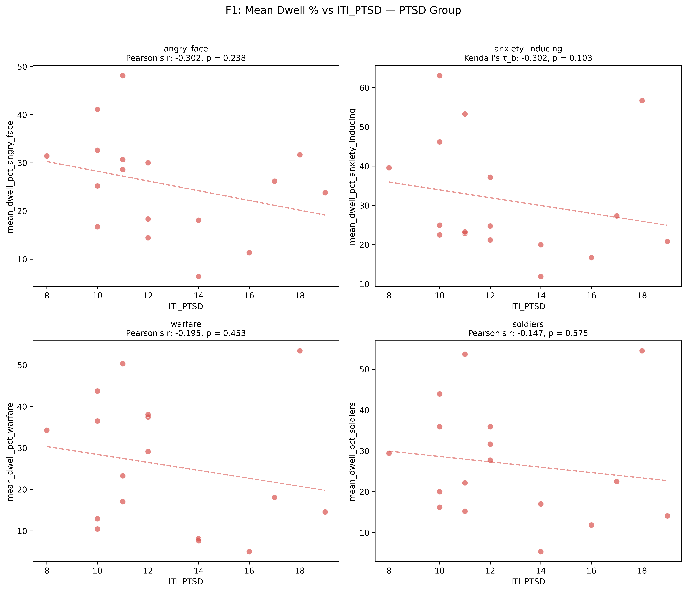
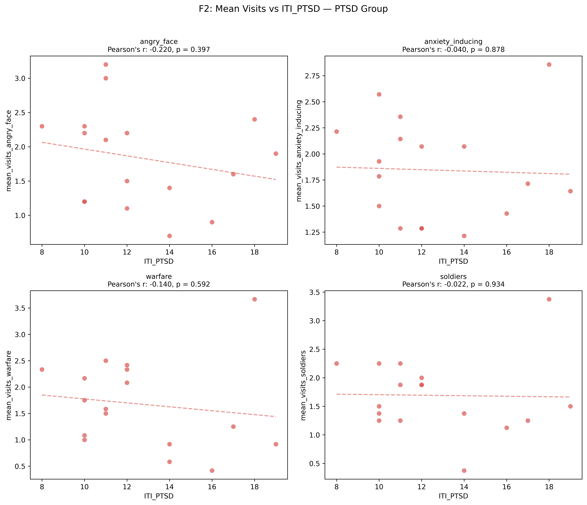
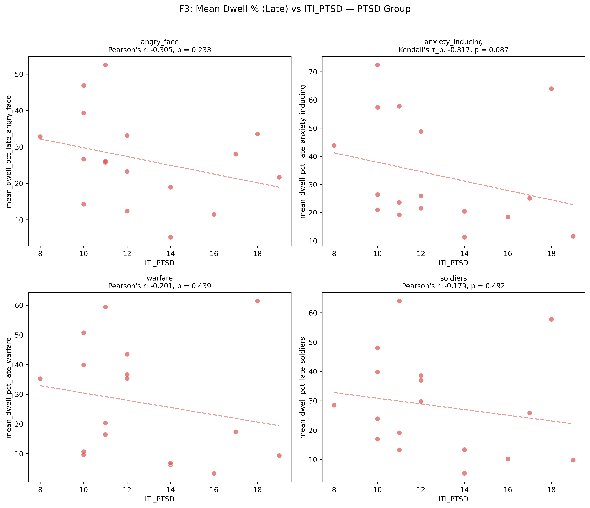
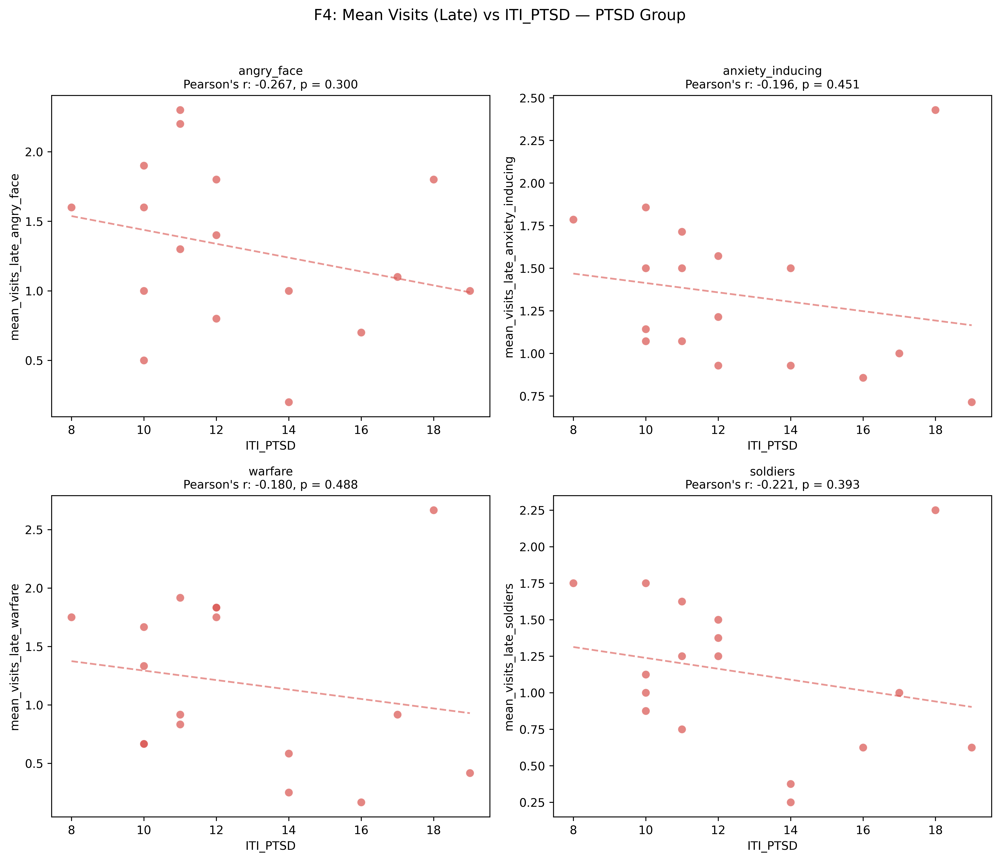
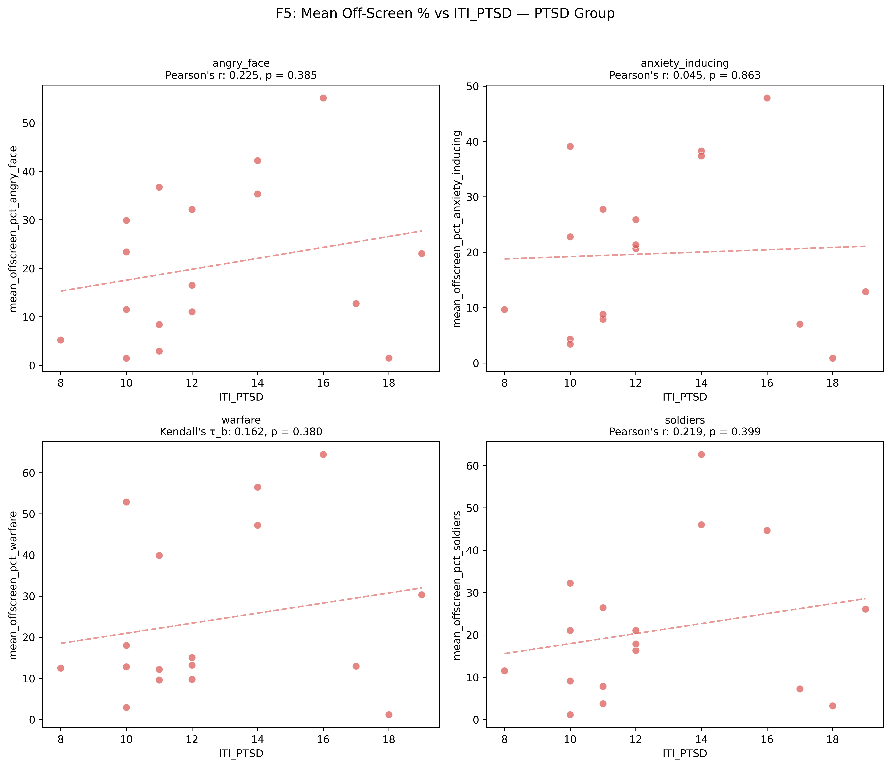
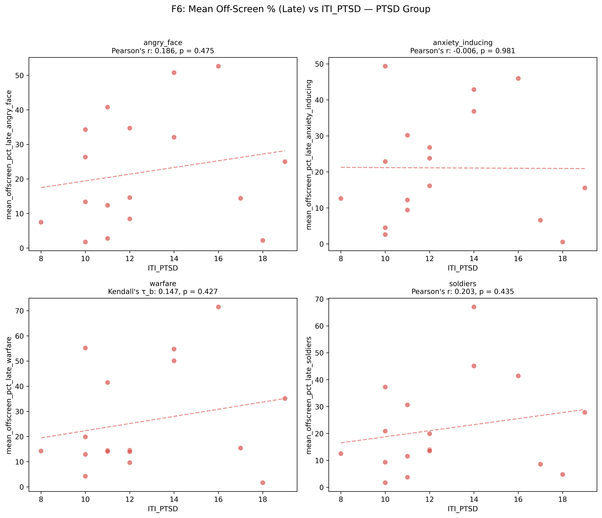
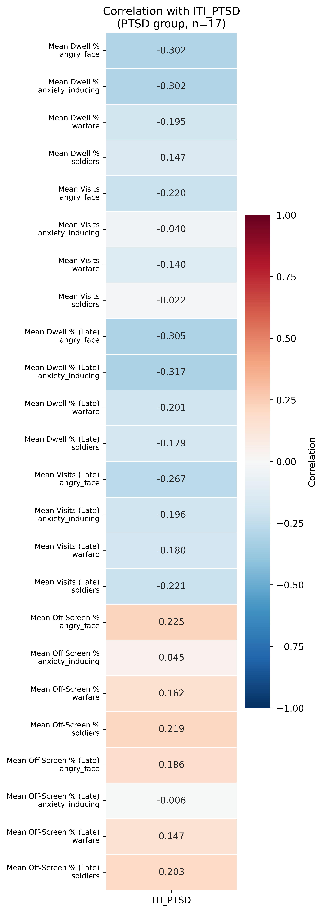

# H6: ITI Score and Avoidance-Like Gaze Behavior in PTSD Group

**Notebook**: `hypotheses_testing/h6_iti_avoidance_gaze.py`

## Hypothesis

**H6**: Within the PTSD subgroup (n=17), greater PTSD symptom severity (ITI score) is associated with more avoidance-like gaze toward threat stimuli — operationalised as lower dwell time, fewer visits, and higher off-screen looking.

**Note**: This is a **feasibility-limited** hypothesis. With n≈8–9 per subgroup (Part A) and n=17 (Part B), statistical power is severely limited. Results should be interpreted as exploratory/feasibility findings.

## Method

- **Participants**: 17 (PTSD group only)
- **Independent variable**: `ITI_PTSD` (PTSD symptom severity)
- **Threat categories**: angry_face, anxiety_inducing, warfare, soldiers
- **Dependent variables**: 24 DVs across 6 families:

| Family | DV Pattern | Expected Direction (high ITI) |
|--------|-----------|-------------------------------|
| F1 | `mean_dwell_pct_{cat}` | Lower |
| F2 | `mean_visits_{cat}` | Lower |
| F3 | `mean_dwell_pct_late_{cat}` | Lower |
| F4 | `mean_visits_late_{cat}` | Lower |
| F5 | `mean_offscreen_pct_{cat}` | Higher |
| F6 | `mean_offscreen_pct_late_{cat}` | Higher |

### Dual-approach design

- **Part A — Median-split group comparison**: ITI_PTSD split at median (12.0); Lower-ITI (<12, n=8) vs Higher-ITI (≥12, n=9). Test selection: Shapiro-Wilk → Levene's → Student's t / Welch's t / Mann-Whitney U.
- **Part B — Correlational analysis**: ITI_PTSD as continuous IV. Test selection: Shapiro-Wilk + outlier detection (standardized OLS residuals, |z| > 3) → Pearson's r or Kendall's τ_b.

### Multiple comparison correction

Benjamini-Hochberg (FDR) applied **separately** within each of the 6 families (4 p-values each), for both Part A and Part B — 12 correction rounds total.

## Results

### Median split

- ITI_PTSD median = 12.0
- Lower-ITI (< median): n = 8
- Higher-ITI (≥ median): n = 9

### Part A: Median-Split Group Comparison

#### F1: Mean Dwell % (BH-corrected)

| Category | Test | Statistic | p (uncorr) | p (BH) | Effect Size Type | Effect Size | 95% CI | Sig |
|----------|------|-----------|------------|--------|------------------|-------------|--------|:---:|
| angry_face | Student's t | −2.68 | 0.017 | 0.068 | Cohen's d | −1.30 | [−3.35, 0.74] | No |
| anxiety_inducing | Student's t | −1.50 | 0.154 | 0.309 | Cohen's d | −0.73 | [−2.12, 0.66] | No |
| warfare | Student's t | −0.66 | 0.522 | 0.522 | Cohen's d | −0.32 | [−1.37, 0.73] | No |
| soldiers | Student's t | −0.72 | 0.484 | 0.522 | Cohen's d | −0.35 | [−1.42, 0.72] | No |

#### F2: Mean Visits (BH-corrected)

| Category | Test | Statistic | p (uncorr) | p (BH) | Effect Size Type | Effect Size | 95% CI | Sig |
|----------|------|-----------|------------|--------|------------------|-------------|--------|:---:|
| angry_face | Student's t | −2.11 | 0.052 | 0.208 | Cohen's d | −1.03 | [−2.74, 0.69] | No |
| anxiety_inducing | Student's t | −1.02 | 0.323 | 0.645 | Cohen's d | −0.50 | [−1.67, 0.68] | No |
| warfare | Student's t | −0.28 | 0.782 | 0.782 | Cohen's d | −0.14 | [−1.11, 0.83] | No |
| soldiers | Mann-Whitney U | 29.00 | 0.528 | 0.704 | rank-biserial r | 0.19 | [−0.32, 0.62] | No |

#### F3: Mean Dwell % Late (BH-corrected)

| Category | Test | Statistic | p (uncorr) | p (BH) | Effect Size Type | Effect Size | 95% CI | Sig |
|----------|------|-----------|------------|--------|------------------|-------------|--------|:---:|
| angry_face | Student's t | −2.24 | 0.041 | 0.163 | Cohen's d | −1.09 | [−2.87, 0.70] | No |
| anxiety_inducing | Mann-Whitney U | 21.00 | 0.167 | 0.334 | rank-biserial r | 0.42 | [−0.08, 0.75] | No |
| warfare | Student's t | −0.61 | 0.551 | 0.551 | Cohen's d | −0.30 | [−1.33, 0.74] | No |
| soldiers | Student's t | −0.76 | 0.461 | 0.551 | Cohen's d | −0.37 | [−1.45, 0.71] | No |

#### F4: Mean Visits Late (BH-corrected)

| Category | Test | Statistic | p (uncorr) | p (BH) | Effect Size Type | Effect Size | 95% CI | Sig |
|----------|------|-----------|------------|--------|------------------|-------------|--------|:---:|
| angry_face | Student's t | −1.69 | 0.112 | 0.447 | Cohen's d | −0.82 | [−2.31, 0.66] | No |
| anxiety_inducing | Student's t | −1.00 | 0.333 | 0.504 | Cohen's d | −0.49 | [−1.65, 0.68] | No |
| warfare | Student's t | −0.17 | 0.866 | 0.866 | Cohen's d | −0.08 | [−1.04, 0.88] | No |
| soldiers | Student's t | −0.91 | 0.378 | 0.504 | Cohen's d | −0.44 | [−1.57, 0.69] | No |

#### F5: Mean Off-Screen % (BH-corrected)

| Category | Test | Statistic | p (uncorr) | p (BH) | Effect Size Type | Effect Size | 95% CI | Sig |
|----------|------|-----------|------------|--------|------------------|-------------|--------|:---:|
| angry_face | Student's t | 1.41 | 0.179 | 0.351 | Cohen's d | 0.68 | [−0.66, 2.03] | No |
| anxiety_inducing | Student's t | 1.16 | 0.263 | 0.351 | Cohen's d | 0.56 | [−0.67, 1.80] | No |
| warfare | Mann-Whitney U | 46.00 | 0.370 | 0.370 | rank-biserial r | −0.28 | [−0.67, 0.23] | No |
| soldiers | Student's t | 1.65 | 0.120 | 0.351 | Cohen's d | 0.80 | [−0.66, 2.27] | No |

#### F6: Mean Off-Screen % Late (BH-corrected)

| Category | Test | Statistic | p (uncorr) | p (BH) | Effect Size Type | Effect Size | 95% CI | Sig |
|----------|------|-----------|------------|--------|------------------|-------------|--------|:---:|
| angry_face | Student's t | 1.08 | 0.295 | 0.591 | Cohen's d | 0.53 | [−0.67, 1.73] | No |
| anxiety_inducing | Student's t | 0.78 | 0.450 | 0.600 | Cohen's d | 0.38 | [−0.71, 1.46] | No |
| warfare | Mann-Whitney U | 41.00 | 0.673 | 0.673 | rank-biserial r | −0.14 | [−0.58, 0.37] | No |
| soldiers | Student's t | 1.30 | 0.213 | 0.591 | Cohen's d | 0.63 | [−0.66, 1.93] | No |

**No comparison reached significance after BH correction in any family.**

### Part B: Correlational Analysis

#### Assumption checks

- ITI_PTSD: Shapiro-Wilk W = 0.905, p = 0.082 → Normal
- No outliers detected across any of the 24 DV pairs (standardized OLS residuals, |z| > 3)
- 4 DVs failed normality (Kendall's τ_b used): mean_dwell_pct_anxiety_inducing, mean_dwell_pct_late_anxiety_inducing, mean_offscreen_pct_warfare, mean_offscreen_pct_late_warfare
- Remaining 20 DVs used Pearson's r

#### F1: Mean Dwell % (BH-corrected)

| Category | Test | Coefficient | p (uncorr) | p (BH) | 95% CI | Sig |
|----------|------|-------------|------------|--------|--------|:---:|
| angry_face | Pearson's r | −0.302 | 0.238 | 0.476 | [−0.68, 0.21] | No |
| anxiety_inducing | Kendall's τ_b | −0.302 | 0.103 | 0.412 | [−0.65, 0.11] | No |
| warfare | Pearson's r | −0.195 | 0.453 | 0.575 | [−0.62, 0.32] | No |
| soldiers | Pearson's r | −0.147 | 0.575 | 0.575 | [−0.59, 0.36] | No |

#### F2: Mean Visits (BH-corrected)

| Category | Test | Coefficient | p (uncorr) | p (BH) | 95% CI | Sig |
|----------|------|-------------|------------|--------|--------|:---:|
| angry_face | Pearson's r | −0.220 | 0.397 | 0.934 | [−0.63, 0.29] | No |
| anxiety_inducing | Pearson's r | −0.040 | 0.878 | 0.934 | [−0.51, 0.45] | No |
| warfare | Pearson's r | −0.140 | 0.592 | 0.934 | [−0.58, 0.37] | No |
| soldiers | Pearson's r | −0.022 | 0.934 | 0.934 | [−0.50, 0.46] | No |

#### F3: Mean Dwell % Late (BH-corrected)

| Category | Test | Coefficient | p (uncorr) | p (BH) | 95% CI | Sig |
|----------|------|-------------|------------|--------|--------|:---:|
| angry_face | Pearson's r | −0.306 | 0.233 | 0.466 | [−0.69, 0.21] | No |
| anxiety_inducing | Kendall's τ_b | −0.317 | 0.087 | 0.346 | [−0.65, 0.09] | No |
| warfare | Pearson's r | −0.201 | 0.439 | 0.492 | [−0.62, 0.31] | No |
| soldiers | Pearson's r | −0.179 | 0.492 | 0.492 | [−0.61, 0.33] | No |

#### F4: Mean Visits Late (BH-corrected)

| Category | Test | Coefficient | p (uncorr) | p (BH) | 95% CI | Sig |
|----------|------|-------------|------------|--------|--------|:---:|
| angry_face | Pearson's r | −0.267 | 0.300 | 0.488 | [−0.66, 0.24] | No |
| anxiety_inducing | Pearson's r | −0.196 | 0.451 | 0.488 | [−0.62, 0.31] | No |
| warfare | Pearson's r | −0.181 | 0.488 | 0.488 | [−0.61, 0.33] | No |
| soldiers | Pearson's r | −0.222 | 0.393 | 0.488 | [−0.63, 0.29] | No |

#### F5: Mean Off-Screen % (BH-corrected)

| Category | Test | Coefficient | p (uncorr) | p (BH) | 95% CI | Sig |
|----------|------|-------------|------------|--------|--------|:---:|
| angry_face | Pearson's r | 0.225 | 0.385 | 0.532 | [−0.29, 0.64] | No |
| anxiety_inducing | Pearson's r | 0.045 | 0.863 | 0.863 | [−0.45, 0.51] | No |
| warfare | Kendall's τ_b | 0.162 | 0.380 | 0.532 | [−0.25, 0.55] | No |
| soldiers | Pearson's r | 0.219 | 0.399 | 0.532 | [−0.29, 0.63] | No |

#### F6: Mean Off-Screen % Late (BH-corrected)

| Category | Test | Coefficient | p (uncorr) | p (BH) | 95% CI | Sig |
|----------|------|-------------|------------|--------|--------|:---:|
| angry_face | Pearson's r | 0.186 | 0.475 | 0.633 | [−0.32, 0.61] | No |
| anxiety_inducing | Pearson's r | −0.006 | 0.981 | 0.981 | [−0.49, 0.48] | No |
| warfare | Kendall's τ_b | 0.147 | 0.427 | 0.633 | [−0.28, 0.55] | No |
| soldiers | Pearson's r | 0.203 | 0.435 | 0.633 | [−0.31, 0.62] | No |

**No correlation reached significance after BH correction in any family.**

## Figures

### Part A: Median-Split Group Comparison

#### Violin + strip plots (all families)

#### Forest plot — effect sizes

#### Bar charts — group means with 95% CI

### Part B: Correlational Analysis

#### Scatterplots — F1: Mean Dwell %

#### Scatterplots — F2: Mean Visits

#### Scatterplots — F3: Mean Dwell % (Late)

#### Scatterplots — F4: Mean Visits (Late)

#### Scatterplots — F5: Mean Off-Screen %

#### Scatterplots — F6: Mean Off-Screen % (Late)

#### Forest plot — correlation coefficients

#### Correlation heatmap

#### Outlier inspection

#### Homoscedasticity inspection

## Conclusion

**H6 is NOT supported.** Neither the median-split group comparison (Part A) nor the correlational analysis (Part B) revealed statistically significant associations between ITI PTSD severity and avoidance-like gaze behavior toward threat stimuli, across any of the 6 DV families, before or after Benjamini-Hochberg correction.

### Directional trends

Despite the lack of significance, the direction of effects was largely **consistent with the avoidance hypothesis**:

- **Part A**: The Higher-ITI subgroup showed lower dwell time, fewer visits, and higher off-screen percentages across most threat categories — the expected avoidance pattern. Effect sizes ranged from small to large (Cohen's d: 0.08–1.30; rank-biserial r: 0.19–0.42), but all confidence intervals were wide and crossed zero.
- **Part B**: Correlations with dwell and visits metrics were uniformly negative (r = −0.02 to −0.32), and correlations with off-screen metrics were mostly positive (r = −0.01 to 0.23) — consistent with the expected direction. The strongest trends were in the anxiety_inducing category for dwell metrics (τ_b ≈ −0.30 to −0.32).

### Caveats

- **Severely limited power**: With n=8 vs n=9 (Part A) and n=17 (Part B), the study is dramatically underpowered. For Part B, a correlation of |r| ≥ 0.48 would be needed for 80% power at α = 0.05 (two-tailed). For Part A, detecting a large effect (d = 0.8) with n=8 vs n=9 requires α ≈ 0.20 for 50% power.
- **Multiple testing burden**: With 24 DVs per approach and BH correction applied within 6 families of 4, the correction was relatively lenient. Even so, no uncorrected p-value fell below 0.05 in Part B, and only a few borderline results appeared in Part A (e.g., F1 angry_face p = 0.017 uncorrected → p = 0.068 corrected).
- **Restriction of range**: ITI_PTSD scores ranged from 8 to 19 (SD = 3.18) within the PTSD group. This restricted range attenuates correlations that might be visible across the full severity spectrum.
- **Consistent direction**: The consistency of directional trends across families and methods suggests that a real but small avoidance effect may exist, undetectable at this sample size. A larger sample (n ≥ 50 within the PTSD group) would be needed to evaluate this reliably.
